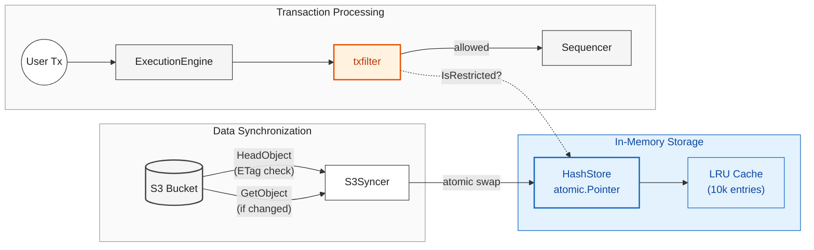

# Restricted Address Filtering - Architecture

## Overview

The `restrictedaddr` package provides compliance-based address filtering for Nitro sequencers. It maintains a list of restricted address hashes (loaded from S3) and blocks transactions involving those addresses.

## Architecture Diagram



## Data Flow

| Flow | Description |
|------|-------------|
| **Sync** | S3 → S3Syncer → HashStore (atomic swap on ETag change) |
| **Lookup** | txfilter → HashStore → LRU cache or `sha256(salt \|\| addr)` hash lookup |
| **Transaction** | User → ExecutionEngine → txfilter → Sequencer |

## Components

| Component | Role |
|-----------|------|
| **Service** | Orchestrates lifecycle: initialization, polling, shutdown |
| **S3Syncer** | Polls S3 via HeadObject, downloads on ETag change (multipart, 10 concurrent parts) |
| **HashStore** | Lock-free storage with `atomic.Pointer`, per-snapshot LRU cache (10k entries) |
| **txfilter** | Blocks transactions touching restricted addresses |

## Package Structure

```
restrictedaddr/
├── config.go       # Configuration struct and validation
├── service.go      # Service lifecycle (Initialize, Start, Stop)
├── s3_sync.go      # S3 polling and concurrent download
├── hash_store.go   # Lock-free hash storage with LRU caching
└── service_test.go # Unit and integration tests
```

## Configuration

| Option | Default | Description |
|--------|---------|-------------|
| `--restricted-addr.enable` | `false` | Enable the service |
| `--restricted-addr.s3-bucket` | - | S3 bucket name (required if enabled) |
| `--restricted-addr.s3-region` | - | AWS region (required if enabled) |
| `--restricted-addr.s3-object-key` | - | Path to hash list JSON (required if enabled) |
| `--restricted-addr.s3-access-key` | - | AWS access key (optional, uses default chain) |
| `--restricted-addr.s3-secret-key` | - | AWS secret key (optional) |
| `--restricted-addr.poll-interval` | `5m` | Interval between S3 ETag checks |

## S3 Hash List Format

```json
{
  "salt": "hex_encoded_salt",
  "address_hashes": [
    {"hash": "hex_encoded_32byte_sha256"},
    {"hash": "hex_encoded_32byte_sha256"}
  ]
}
```

**Hash computation:** `SHA256(salt || address_bytes)` - addresses are never stored in plaintext.

## Service Lifecycle

1. **NewService** - Validates config, creates S3 client
2. **Initialize** - Blocking initial download (node won't start if this fails)
3. **Start** - Begins background polling goroutine
4. **StopAndWait** - Graceful shutdown

The service initializes **early** in the node startup sequence (before inbox tracker, transaction streamer, etc.) to ensure filtering is active before any transactions are processed.

## HashStore Design

- **Lock-free reads:** Uses `atomic.Pointer[hashData]` for concurrent access
- **Double-buffering:** New data prepared while old data still serves requests
- **Per-snapshot LRU:** Each atomic swap includes a fresh 10k-entry cache
- **Lookup methods:**
  - `IsRestricted(addr)` - Single address check
  - `IsAnyRestricted(addrs)` - True if any address restricted
  - `IsAllRestricted(addrs)` - True only if all addresses restricted

## Transaction Filtering Points

Transactions are blocked if any of these addresses are restricted:

| Operation | Addresses Checked |
|-----------|-------------------|
| Transfer | Sender, Recipient |
| CALL | Target contract |
| STATICCALL | Target contract |
| CREATE/CREATE2 | New contract address |
| SELFDESTRUCT | Beneficiary address |

## S3 Polling Strategy

1. **HeadObject** call to check ETag (lightweight, no data transfer)
2. If ETag unchanged, skip download
3. If ETag changed:
   - Download to temp file (multipart: 32MB parts, 10 concurrent, 5 retries/part)
   - Parse and validate JSON
   - Atomic pointer swap into HashStore
4. Repeat after `poll-interval`
