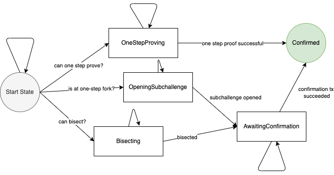

# BOLD Architecture

When explaining how all components of BOLD fit together, it’s helpful to consider the software that runs an actual validator for Arbitrum: Arbitrum Nitro. Some of its responsibilities are:

- To **execute incoming transactions** from an Inbox contract and produce post-states according to the L2 state transition
- To **submit transaction batches** to Ethereum L1 to a contract known as the SequencerInbox
- To validate transactions and submit claims known as **assertions** about the L2 state at frequent intervals to Ethereum, to a contract known as `RollupCore.sol`
- To **challenge** incorrect assertions posted by dishonest validators to `RollupCore.sol`

Most importantly, Arbitrum technology is moving into a more modular architecture in which specific components can be run as standalone binaries, allowing for greater resilience and easier changes in the future. BOLD implements a component of Nitro responsible for posting assertions and challenging invalid ones, and therefore depends on other parts of the Nitro node to provide it with the state data it needs. The BOLD repository is a standalone Github project separate from Nitro, as it can be plugged into Nitro chains as a dependency to perform its roles.

## How it Works

The **BOLD Challenge Manager** above interacts with a few items from an Arbitrum node, allowing it to make challenge moves and submit history commitments to the contracts on Ethereum. In our code, abstract away those L2 node components via a small interface called the **L2 State Provider**. 

Recall the core primitive of the protocol are **challenge edges**, where an edge represents a start and end history commitment to an Arbitrum chain. Participants in the protocol can make **moves** on challenges, and validators can **participate in many challenges concurrently.** That is, our software needs to track edges within a challenge and their lifecycle in order to win against malicious entities. 

Our detailed architecture looks like this:

Here's how it works:

1. An **Assertion Poster** frequently takes validated messages from the L2 validator and posts them onchain
2. An **Assertion Scanner** checks smart contracts on Ethereum for newly posted assertions and compares them against the local Nitro node’s DB. This is done via an abstraction known as a **L2 State Provider**. This is within `assertions/scanner.go`
3. If we disagree with an assertion, our **Challenge Manager** submits an onchain challenge by creating a level zero edge, and tracks that edge as a go routine
4. Our **Chain Watcher**, in the background, scans for other created edges onchain and spawns edge tracker goroutines for honest edges we are not yet tracking

Each edge is tracked as a goroutine called an **Edge Tracker**. Edge trackers are self-contained goroutines that wake up at specified tick intervals and use a finite state machine to decide what challenge move to take. For example, after an edge is created, it will try to bisect, confirm via one step proof, or create a subchallenge depending on its current state.

Here's what the finite state machine of an edge tracker looks like, with its final state being `Confirmed`:

Once a level zero edge for a challenge on an assertion is confirmed, the assertion can then be confirmed and the honest party will emerge successful.