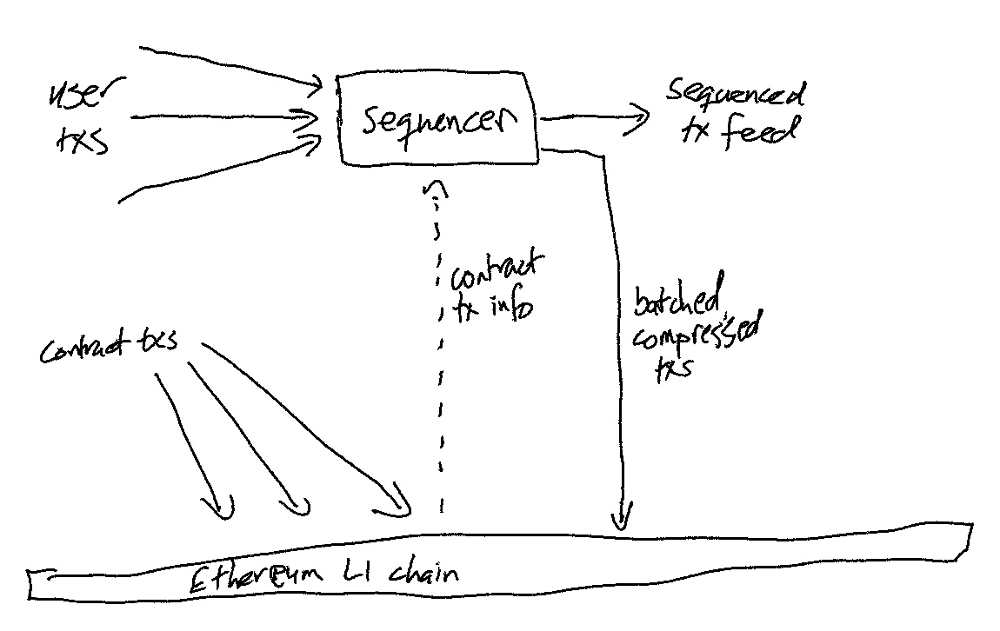
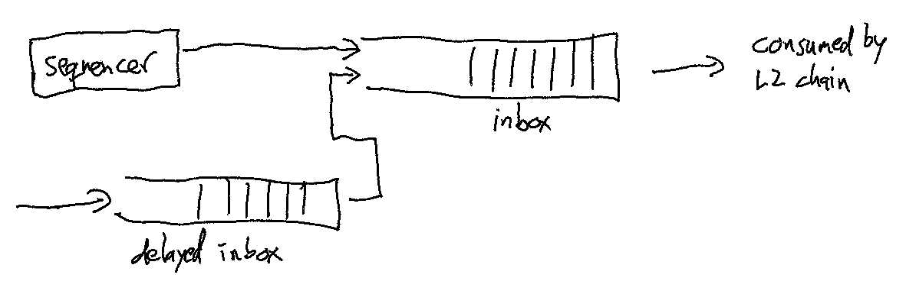
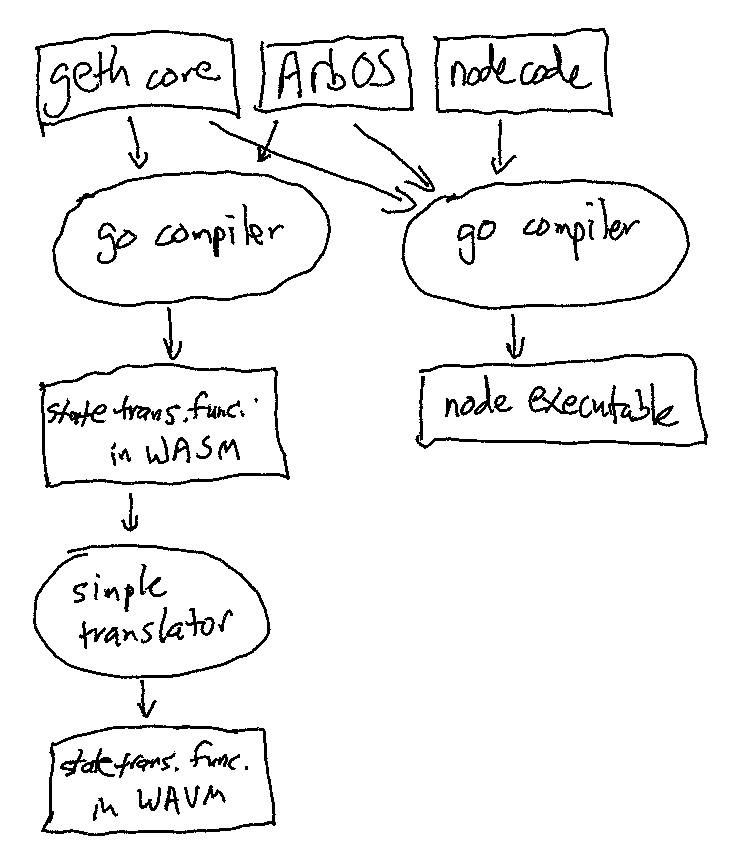
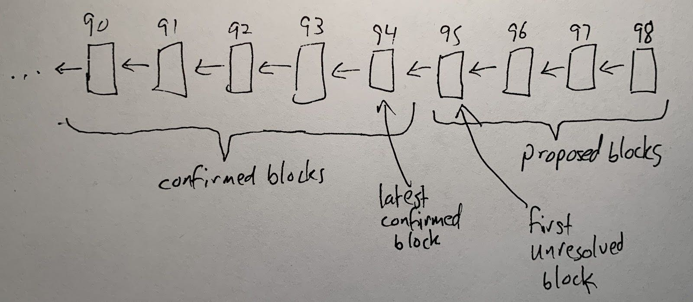
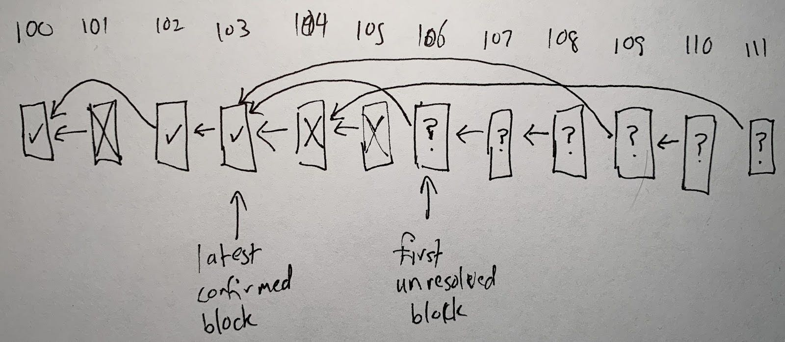
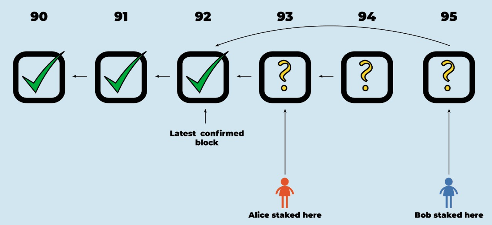

# Inside Arbitrum Nitro

This document is a deep-dive explanation of Arbitrum Nitro’s design and the rationale for it. This isn’t API documentation, nor is it a guided tour of the code--look elsewhere for those. “Inside Arbitrum Nitro” is for people who want to understand how Nitro works and the logic behind its design.

## Why Use Arbitrum?

Arbitrum is an L2 scaling solution for Ethereum, offering a unique combination of benefits:

* Trustless security: security rooted in Ethereum, with any one party able to ensure correct Layer 2 results
* Compatibility with Ethereum: able to run unmodified EVM contracts and unmodified Ethereum transactions
* Scalability: moving contracts’ computation and storage off of the main Ethereum chain, allowing much higher throughput
* Minimum cost: designed and engineered to minimize the L1 gas footprint of the system, minimizing per-transaction cost.

Some other Layer 2 systems provide some of these features, but to our knowledge no other system offers the same combination of features at the same cost.

## Nitro Architecture: The Big Picture

Arbitrum Nitro is built around four concepts:

* optimistic rollup
* sequencing, then deterministic execution
* geth at the core
* separate execution from proving.

In this chapter, we’ll expand on each of these.

### Optimistic Rollup

Arbitrum is an optimistic rollup. Let’s unpack that term.

*Rollup*

Arbitrum is a rollup, which means that the inputs to the chain—the messages that are put into the chain’s inbox—are all recorded on the Ethereum chain as calldata. Because of this, everyone has the information they would need to determine the current correct state of the chain—they have the full history of the inbox, and the results are uniquely determined by the inbox history, so they can reconstruct the state of the chain based only on public information, if needed.

This also allows anyone to be a full participant in the Arbitrum protocol, to run an Arbitrum node or participate as a validator. Nothing about the history or state of the chain is a secret.

*Optimistic*

Arbitrum is optimistic, which means that Arbitrum advances the state of its chain by letting any party (a “validator”) post a rollup block that that party claims is correct, and then giving everyone else a chance to challenge that claim. If the challenge period (roughly a week) passes and nobody has challenged the claimed rollup block, Arbitrum confirms the rollup block as correct. If someone challenges the claim during the challenge period, then Arbitrum uses an efficient dispute resolution protocol (detailed below) to identify which party is lying. The liar will forfeit a deposit, and the truth-teller will take part of that deposit as a reward for their efforts (some of the deposit is burned, guaranteeing that the liar is punished even if there's some collusion going on).

Because a party who tries to cheat will lose a deposit, attempts to cheat should be very rare, and the normal case will be a single party posting a correct rollup block, and nobody challenging it.

### Sequencing, Then Deterministic Execution

The second design principle in Nitro is separation of sequencing from execution of transactions. First, submitted transactions are ordered into a fixed sequence and recorded where everyone can see them. Then the sequenced transactions are executed to determine their results. Execution is deterministic so that the result of a transaction is uniquely determined by the transaction itself, everything before it in the sequence, and nothing else.

Determinism ensures that once a transaction has been sequenced, its result is fully determined and available to everyone. In other words, it has finality—nothing that anyone does can affect its outcome.

Sequencing doesn’t ensure that a transaction will succeed, but it does ensure that the transaction will be attempted, exactly as it was submitted. If the deterministic result is failure, then the transaction’s failure has finality.

We’ll go into much more detail on sequencing in a later section.

### Geth at the Core

One of the most important questions for an Ethereum-compatible L2 is how it emulates the behavior of the Ethereum Virtual Machine (EVM).  Nitro’s answer is that it incorporates the core of go-ethereum (“geth”) which is the most popular Ethereum node software.

Nitro includes geth as a submodule. When Nitro needs to execute a transaction, create a block, or access the chain’s state, it calls geth functionality. This ensures that transactions behave the same way on Nitro as they would on Ethereum (but faster!) and that third-party tooling that is built to work with Ethereum blocks and Ethereum transactions will work with Nitro easily.

Nitro makes a few minor changes to geth, for example to create transaction types for things like L1-to-L2 deposits, and to add hooks to allow charging transactions for their L1 costs.  The Nitro team has forked the geth codebase to do this. You can see that forked code in the Offchain Labs GitHub space.

### Separate Execution from Proving

The final design principle is that execution and proving should use code paths that are different but closely related. The code path for ordinary execution is optimized for execution speed, and the one for proving is optimized, as you’d guess, for efficient proving.

The code for the two paths is built from the same source code, written in the go language.  For execution, the code is simply compiled to native code by the normal go compiler.  Every node runs this code, compiled for its local machine.

For proving, the source code is compiled to Web Assembly (WASM), a machine-independent code format.  This is coupled with a prover that can prove the result of executing WASM code. The WASM prover is one of the crucial innovations in Nitro—and we’ll have much more to say about it in a later section.  Executing the code in WASM would be slow, because WASM interpreters or just-in-time compilers are slower than native code execution, but proving is rare and doesn’t need to go fast, it only needs to be not-too-slow.

### Filling in the Rest

To get from these four concepts to a full description of Nitro, we’ll need to answer questions like these:

* Who keeps track of the inbox, chain state, and outputs?
* How does Arbitrum make sure that the chain state and outputs are correct?
* How can Ethereum users and contracts interact with Arbitrum?
* How does Arbitrum support Ethereum-compatible contracts and transactions?
* How are ETH and tokens transferred into and out of Arbitrum chains, and how are they managed while on the chain?
* How can I run my own Arbitrum node or validator?

## Interactive Proving  

Among optimistic rollups, the most important design decision is how to resolve disputes. Suppose Alice claims that the chain will produce a certain result, and Bob disagrees. How will the protocol decide which version to accept?

There are basically two choices: interactive proving, or re-executing transactions. Arbitrum uses interactive proving, which we believe is more efficient and more flexible. Much of the design of Arbitrum follows from this fact.

### Interactive proving: how it works

The idea of interactive proving is that Alice and Bob will engage in a back-and-forth protocol, refereed by an L1 contract, to resolve their dispute with minimal work required from any L1 contract.

Arbitrum's approach is based on dissection of the dispute. Roughly speaking, if Alice's claim covers N steps of execution, she posts two claims of size N/2 which combine to yield her initial N-step claim, then Bob picks one of Alice's N/2-step claims to challenge. Now the size of the dispute has been cut in half. This process continues, cutting the dispute in half at each stage, until they are disagreeing about a single step of execution. Note that so far the L1 referee hasn't had to think about execution "on the merits". It is only once the dispute is narrowed down to a single step that the L1 referee needs to resolve the dispute by looking at what the instruction actually does and whether Alice's claim about it is correct.

The key principle behind interactive proving is that if Alice and Bob are in a dispute, Alice and Bob should do as much off-chain work as possible needed to resolve their dispute, rather than putting that work onto an L1 contract. The L1 contract only needs to identify that either Alice or Bob is lying or refusing to respond.

### Re-executing transactions: how it works

The alternative to interactive proving would be to have a rollup block contain a claimed machine state hash after every individual transaction. Then in case of a dispute, the L1 referee would emulate the execution of an entire transaction, to see whether the outcome matches Alice's claim.

### Why interactive proving is better

We believe strongly that interactive proving is the superior approach, for the following reasons.

**More efficient in the optimistic case**: Because interactive proving can resolve disputes that are larger than one transaction, it can allow a rollup block to contain only a single claim about the end state of the chain after the execution of many transactions. By contrast, re-execution requires posting a state claim for each transaction within the rollup block. With hundred or thousands of transactions per rollup block, this is a substantial difference in L1 footprint—and L1 footprint is the main component of cost.

**More efficient in the pessimistic case**: In case of a dispute, interactive proving requires the L1 referee contract only to check that Alice and Bob's actions "have the right shape", for example, that Alice has divided her N-step claim into two claims half as large. (The referee doesn't need to evaluate the correctness of Alice's claims—Bob does that, off-chain.) Only one instruction needs to be re-executed. By contrast, re-execution requires the L1 referee to emulate the execution of an entire transaction.

**Much higher per-transaction gas limit**: Interactive proving can escape from Ethereum's tight per-transaction gas limit; a transaction that requires so much gas it couldn't even fit into an Ethereum block is possible on Arbitrum. The gas limit isn't infinite, for obvious reasons, but it can be much larger than on Ethereum. As far as Ethereum is concerned, the only downside of a gas-heavy Arbitrum transaction is that it may require an interactive fraud proof with slightly more steps (and only if indeed it is fraudulent). By contrast, re-execution must impose a lower gas limit than Ethereum, because it must be possible to emulate execution of the transaction (which is more expensive than executing it directly) within a single Ethereum transaction.

### Interactive proving drives the design of Arbitrum

Much of the design of Arbitrum is driven by the opportunities opened up by interactive proving. If you're reading about some feature of Arbitrum, and you're wondering why it exists, two good questions to ask are: "How does this support interactive proving?" and "How does this take advantage of interactive proving?" The answers to most "why questions" about Arbitrum relate to interactive proving.

## Lifecycle of an Arbitrum Transaction

One useful way to understand how Arbitrum works is to follow the lifecycle of a transaction, to see how it is processed and resolved.  Let’s tell the story of a single transaction in Arbitrum.

Let’s assume that Alice is using an Arbitrum-based dapp. She is using the dapp’s browser-based user interface, and she has connected her Ethereum wallet to the Arbitrum One network.

### Creating Alice’s transaction

Our transaction is born when Alice clicks a button in the dapp’s user interface, asking to submit a transaction. This causes Alice’s wallet to pop up a dialog, asking her to approve the transaction. Alice clicks OK to approve the transaction.

Now Alice’s wallet will digitally sign the transaction and automatically send it to the Arbitrum Sequencer, a special Arbitrum node that is currently run by Offchain Labs. (The Sequencer is not the only way to submit transactions, but it’s the fastest, cheaper, and most common way.) 

### Sequencing Alice’s transaction

The Sequencer is receiving transactions from lots of different users. The job of the Sequencer, as its name would suggest, is to establish an ordering on these incoming transactions, on a first-come, first-served basis. The Sequencer puts Alice’s transaction into its transaction sequence, and publishes the transaction in the “Sequencer feed” so other Arbitrum nodes know about Alice’s transaction and where it is in the ordering. 

Execution in Arbitrum is deterministic, so now that Alice’s transaction has been sequenced, and the transactions ahead of hers in the sequence are known, any node can compute what the result of Alice’s transaction will be. The Sequencer does this and sends the result back to Alice.  

Roughly one second has elapsed from Alice’s clicking the OK button in her wallet to the transaction result being returned and reflected in the dapp user interface she sees.

At this point, Alice’s role in the transaction is complete and she can turn her attention elsewhere. Meanwhile, the Arbitrum chain’s gears keep on turning, to ensure that Alice’s transaction will be fully certified.

### Recording the transaction sequence

Perhaps 30 seconds later, the Sequencer will publish a transaction batch on the L1 Ethereum chain. This batch will include hundreds or thousands or transactions, including Alice’s, bundled together into a single byte-string and then compressed. This records the ordering of transactions, as promised by the Sequencer.

### Certifying the result of Alice’s transaction on Ethereum

Now the only thing that remains is to certify the result of Alice’s transaction on the L1 Ethereum chain. The result of Alice’s transaction is included in an Arbitrum L2 block that is known to all Arbitrum nodes—a block that is fully determined by the transaction sequence—but the Ethereum chain doesn’t know the result, and Ethereum doesn’t have the horsepower to compute the result for itself. This is where the Arbitrum rollup protocol comes into play.

Perhaps 45 minutes later, an Arbitrum validator posts a claimed rollup block that includes the result of Alice’s transaction. The validator has staked ETH on the correctness of its claim. (Anyone can be an Arbitrum validator.)

Other Arbitrum validators see the claimed rollup block and check whether it’s correct.  In our story the claim is correct, so the other validators don’t need to do anything.  (If the claim was incorrect, other validators would challenge it and the Arbitrum protocol would eventually reject the claim.). 

A week passes with no challenges to the claimed rollup block, so the claim is certified as correct on the L1 Ethereum chain.  Now Ethereum know what everyone else has known for a week or so.  Alice’s transaction and its result are now fully archived in the Arbitrum chain’s history.

### Overview

We’ll go into more detail later about how all of this works. For now, let’s stop and look back at the story of Alice’s transaction. What are the take-aways?

First, Alice’s role in this process will be familiar to any Ethereum user.  She uses a dapp with the same type of browser-based UI that she is accustomed to. She uses the same wallet that she uses for Ethereum.  Her user experience is about the same as on Ethereum—except that she gets a result for her transaction much faster, in about one second.

After Alice gets her result, a lot of activity takes place internally within Arbitrum, but Alice doesn’t need to worry about that. Nor does she even need to pay attention to it. Alice can “live at L2,” enjoying the speed and low cost of Arbitrum.

## Arbitrum Architecture

This diagram shows the basic architecture of Arbitrum.

[TODO: redraw diagram]

On the left we have users and the service providers who help them connect to the chain(s) of their choice. On the right we have the Arbitrum system itself, built in layers on top of Ethereum.

We’ll work our way up on the right side to describe how the Arbitrum stack works, then we’ll talk about what happens on the left side to connect users to it.

On the bottom right is good old Ethereum. Arbitrum builds on Ethereum and inherits its security from Ethereum.

On top of Ethereum is the EthBridge, a set of Ethereum contracts that manage an Arbitrum chain. The EthBridge referees the Arbitrum rollup protocol, which ensures that the layers above it operate correctly. (More on the rollup protocol below in the Rollup Protocol section.) The EthBridge also maintains the chain’s inbox and outbox, allowing people and contracts to send transaction messages to the chain, and to observe and use the outputs of those transactions. Users, L1 Ethereum contracts, and Arbitrum nodes make calls to the EthBridge contracts to interact with the Arbitrum chain.

[TODO--update this section for Nitro] The next layer up is ArbOS. This is a software program, written by Offchain Labs, that runs on the Arbitrum Virtual Machine, and serves as a record-keeper, traffic cop, and enforcer for the execution of smart contracts on the Arbitrum chain. It’s called ArbOS because it plays a role like a (lightweight version of) the operating system on a laptop or phone--it’s the program that starts up first and that manages the execution of all other code on the chain. Importantly, ArbOS runs entirely at Layer 2, off of the Ethereum chain, so it can take advantage of the scalability and low cost of Layer 2 computation.

The horizontal layer boundary above ArbOS is called EVM compatibility because ArbOS provides an Ethereum Virtual Machine compatible execution environment for smart contracts. That is, you can send ArbOS the EVM code for a contract, in the same way you would send that contract to Ethereum, and ArbOS will load the contract and enable it to service transactions, just like on Ethereum. ArbOS takes care of the details of compatibility, so the smart contract programmer can just write their code like they would on Ethereum (or often, just take existing Ethereum contracts and redeploy them).

At the top of the stack--the upper right portion of the diagram--are EVM contracts which have been deployed to the Arbitrum chain by developers, and which execute transactions that are submitted to the chain.

That’s the right hand side of the diagram, which provides the Arbitrum chain functionality. Now let’s turn to the left side, which more directly supports users.

On the lower left are standard Ethereum nodes, which are used to interact with the Ethereum chain. Just above that are Arbitrum nodes. As the name suggests, these are used to interact with Arbitrum. They support the same API as Ethereum nodes, so they work well with existing Ethereum tools -- you can point your Ethereum-compatible wallet or tools at an Arbitrum node and they’ll be able to talk to each other. Just like on Ethereum, anyone can run an Arbitrum node, but many people will choose instead to rely on a node run by someone else.

Some Arbitrum nodes service user requests, and others choose to serve only as validators, which work to ensure the correctness of the Arbitrum chain. (See the Validators section for details.)

Last, but certainly not least, we see users on the upper left. Users use wallets, dapp front ends, and other tools to interact with Arbitrum. Because Arbitrum nodes support the same API as Ethereum, users don’t need entirely new tooling and developers don’t need to rewrite their dapps.

## Living at L2 versus Living at L1

A useful concept in thinking about Arbitrum functionality is distinguishing things that “live at L2” from things that “live at L1.” 

If you’re living at L2, you see the Arbitrum chain as an entity in itself, and you don’t concern yourself with anything that is happening to make the chain operate correctly. You’re the passenger on the train who isn’t watching the driver or worrying about how the engine works. 

Living at L1 means that you are watching and participating in the mechanisms that drive correct operation of the Arbitrum chain. 

It’s not only people who can live at L2 or L1. Servers or contracts can live at L2 or L1. As an example, Arbitrum validators live at L1, because they participate in the rollup protocol, which is managed by the L1 EthBridge contracts, to ensure that correct execution of the chain is confirmed. 

On the other hand, Arbitrum full nodes typically live at L2, because they run a copy of the L2 chain locally, and assume that the L1 mechanisms will ensure that the same result that they compute locally will eventually be confirmed by the L1 mechanisms that they don’t monitor.

Most Arbitrum users, most of the time, will be living at L2. They will be interacting with an Arbitrum chain as just another chain, without worrying about the L1 details that ensure that the chain won’t go wrong. That’s as it should be—the passengers shouldn’t have to worry about how the train engine works.

## The EthBridge

The EthBridge is a set of Ethereum contracts that manage an Arbitrum chain. The EthBridge keeps track of the chain’s inbox contents, the hash of the chain’s state, and information about the outputs. The EthBridge is the ultimate source of authority about what is going on in the Arbitrum chain.

The EthBridge is the foundation that Arbitrum’s security is built on. The EthBridge runs on Ethereum, so it is transparent and executes trustlessly.

The *Inbox contract* manages the chain’s inbox. Inbox keeps track of the (hash of) every message in the inbox. Calling one of the send methods of Inbox will insert a message into the Arbitrum chain’s inbox. The Inbox contract makes sure that certain information in incoming messages is accurate: that the sender is correctly recorded, and that the Ethereum block number and timestamp are correctly recorded in the message.

Unsurprisingly, there is also an *Outbox contract*, which manages outputs of the chain; i.e., messages originating from Arbitrum about something that should (eventually) happen back on Ethereum (notably, withdrawals). When a rollup block is confirmed, the outputs produced in that rollup block are put into the outbox. How outputs end up being reflected on Ethereum is detailed in the Bridging section.

The *Rollup contract* and its friends are responsible for managing the rollup protocol. They track the state of the Arbitrum chain: the rollup blocks that have been proposed, accepted, and/or rejected, and who has staked on which rollup nodes. The Challenge contract and its friends are responsible for tracking and resolving any disputes between validators about which rollup blocks are correct. The functionality of Rollup, Challenge, and their friends will be detailed below in the Rollup Protocol section.

A sequencer is a standard feature on Arbitrum chains. Although a chain can operate without a sequencer, Arbitrum One has a sequencer and we expect that most chains will.  Offchain Labs runs the sequencer on Arbitrum One.

## The Sequencer

The Sequencer is a specially designated full node, which is given limited power to control the ordering of transactions. This allows the Sequencer to guarantee the results of user transactions immediately, without needing to wait for anything to happen on Ethereum. So no need to wait five minutes or so for block confirmations—and no need to even wait 15 seconds for Ethereum to make a block.

Clients interact with the Sequencer in exactly the same way they would interact with any full node, for example by giving their wallet software a network URL that happens to point to the sequencer.

### Instant confirmation

Without a Sequencer, a node can predict what the results of a client transaction will be, but the node can't be sures of the result, because it can't know or control how the transactions it submits will be ordered in the Inbox, relative to transactions submitted by other nodes.

The Sequencer is given more control over ordering, so it has the power to assign its clients' transactions a position in the Inbox queue, thereby ensuring that it can determine the results of client transactions immediately. The Sequencer's power to reorder has limits (see below for details) but it does have more power than anyone else to influence transaction ordering.

The Sequencer publishes a feed of transactions, representing the sequence of transactions that the Sequencer is promising to include in the chain’s inbox. The Sequencer has the power to keep its promises (because of its special reordering power), so that if the Sequencer is honest, the feed will be accurate, in the sense that the sequence of transactions in the feed is exactly the sequence that the Arbitrum chain will see in its inbox.  (We’ll consider below what happens if the Sequencer is dishonest.) As a result, a node that trusts the Sequencer can treat the feed as definitive. This is useful because new transactions typically show up in the feed within about one second of their arrival at the Sequencer.

### The Delayed Inbox

To give the Sequencer the power it needs, we add new new feature to the chain’s inbox mechanism: the Delayed Inbox.

The Sequencer can put messages, or more often batches of messages, directly into the chain’s Inbox. Non-sequencer parties can’t insert directly into the Inbox but must instead put their messages into the Delayed Inbox, a separate queue that is maintained by the L1 Inbox contract.

)

Messages in the Delayed Inbox will wait there until they're promoted into the main Inbox queue. They can be promoted in two ways: by the Sequencer or on demand after a time delay. 

The Sequencer can promote messages from the head of the Delayed Inbox at any time. Normally the Sequencer does this as part of posting a batch of messages.  A well-behaved Sequencer will promote every message within a few minutes.

If the Sequencer doesn't promote a Delayed Inbox message, and that message has been in the Delayed Inbox for more than a threshold time (currently 24 hours), then anyone can call the Inbox contract to promote the message (or multiple such messages). This ensures that the Sequencer can't censor messages, although it can delay them.

### If the sequencer is well-behaved...

A well-behaved sequencer will accept transactions from all requesters and treat them fairly, giving each one a promised transaction result as quickly as it can.

It will also minimize the delay it imposes on non-sequencer transactions by minimizing how far it backdates transactions, consistent with the goal of providing strong promises of transaction results. Specifically, if the sequencer believes that 20 confirmation blocks are needed to have finality on Ethereum, then it will backdate transactions by 20 blocks. This is enough to ensure that the sequencer knows exactly which transactions will precede its current transaction, because those preceding transactions have finality. There is no need for a benign sequencer to backdate more than that, so it won't.
This does mean that transactions that go through the regular inbox will take longer to get finality. Their time to finality will roughly double: if finality requires C confirmation blocks, then a regular-inbox transaction at block B be processed after sequencer transactions that are inserted at time B+C-1 (but labeled with block B-1), and those sequencer transactions won't have finality until time B+2C-1.
This is the basic tradeoff of having a sequencer: if you use the sequencer, finality is C blocks faster; but if you don't use the sequencer, finality is C blocks slower. This is usually a good tradeoff, because most transactions will use the sequencer; and because the practical difference between instant and 5-minute finality is bigger than the difference between 5-minute and 10-minute finality.
So a sequencer is generally a win, if the sequencer is well behaved.

### If the sequencer is malicious...

A malicious sequencer, on the other hand, could cause some pain. If it refuses to handle your transactions, you're forced to go through the regular inbox, with longer delay. And a malicious sequencer has great power to front-run everyone's transactions, so it could profit greatly at users' expense.

At mainnet launch, Offchain Labs will run a sequencer which will be well-behaved. This will be useful but it's not decentralized. Over time, we'll switch to decentralized, fair sequencing, as described below.

Because the sequencer will be run by a trusted party at first, and will be decentralized later, we haven't built in a mechanism to directly punish a misbehaving sequencer. We're asking users to trust the centralized sequencer at first, until we switch to decentralized fair sequencing later.

### Operating Without a Sequencer

Although most chains will have a sequencer, it is possible to operate an Arbitrum chain without a sequencer.  In this mode, the inbox has no fast path, so all transactions must come in through the slow path.  Of course, there is no need for a delay on the slow path, because there is no sequencer that needs to delay anything.

Without a sequencer, users can still submit transactions through an aggregator, who can bundle transactions together into a batch for efficiency and submit the batch to the inbox in a single L1 transaction.  Aggregators are more efficient if they handle more messages, so we would expect to see a few dominant aggregators, or just one, on a chain.

The drawback of operating without a sequencer is that transactions won’t have finality in any sense until they have been submitted to the L1 inbox and that submission transaction on L1 has L1 finality. So no sub-second response times—more like a few minutes for finality.

### The Future: Decentralized fair sequencing

Having an honest sequencer makes the chain much better. Who doesn’t love sub-second response times?
But a single centralized sequencer is a point of failure, and a point of trust, that should be eliminated if possible. That’s the idea of decentralized fair sequencing.

Viewed from 30,000 feet, decentralized fair sequencing isn't too complicated. Instead of being a single centralized server, the sequencer is a committee of servers, and as long as a suitable supermajority of the committee is honest, the sequencer will establish a fair ordering over transactions.

How to achieve this is more complicated. Research by a team at Cornell Tech, including Offchain Labs CEO and Co-founder Steven Goldfeder, developed the first-ever decentralized fair sequencing algorithm. With some improvements that are under development, these concepts will form the basis for Arbitrum’s longer-term solution, of a fair decentralized sequencer.  We’ll revise Inside Arbitrum Nitro to describe how this work, as it develops.

# Separating Execution from Proving

The diagram below shows how the two programs that implement Nitro are built.  The left compilation path builds the code used in the slower proving mode, and the right compilation path builds the node executable that is used in the common case, the faster execution mode. Because these are built from the same code, and that code is deterministic, there will be an equivalence between the two compilation products, as described in more detail below.

Compilation starts with three bodies of code, shown at the top of the diagram. The geth core is the core of geth, which implements the Ethereum virtual machine and manages the Ethereum-compatible state tree and block format.  ArbOS is the remaining code that is needed to build Arbitrum blocks, which handles functions like L1 fee collection, cross-chain messaging, and Arbitrum-specific precompiles.  The node code is the rest of what is needed to build an Ethereum-compatible node; much of this code comes from geth.

### Compiling for Proving

The left compilation path builds the code that will be used for proving. This is the state transition function, which takes as input an Ethereum-compatible state and an incoming message (usually a single user-submitted transaction) and produces as output a new block for the Arbitrum chain. This is built from the geth core and ArbOS. First, the standard Go compiler is used to compile to Web Assembly (WASM) format, then a simple translator rewrites the WASM code into a very similar WAVM format.

WAVM is the same as WASM, with a few instructions removed from the instruction set (because they are difficult to do one-step proofs over) and a few instructions added (to support interaction with the Ethereum state and similar systems-type interactions.  Translating from WASM to WAVM is straightforward, just replacing certain WASM instructions with equivalent snippets of WAVM code.

The resulting WAVM code is used to resolve disputes. If there is a disagreement between validators about the block produced by a particular incoming message, the challenge protocol will consider this to be a disagreement about the output produced by the WAVM state transition function. The challenge protocol knows the hash of the correct WAVM code, and uses the WAVM code as the definitive specification of what the state transition function should do. Details on dispute resolution are in a later section. 

### Compiling for Node Execution

The other compilation path, shown on the right side of the diagram, builds an Arbitrum node, which implements the normal fast-path execution model. The node includes the same state transition function, implemented in the geth core and ArbOS, adds additional code to implement a complete Ethereum-compatible node, and compiles it with the standard Go compiler to produce a node executable. 

In the normal case, the node is all that will be used. The proving code will be available in case of a challenge but will not be used in the common case.

## Arbitrum Rollup Protocol

Before diving into the rollup protocol, there are two things we need to cover.

First, if you’re an Arbitrum user or developer, you don’t need to understand the rollup protocol. You don’t ever need to think about it, unless you want to. Your relationship with it can be like a train passenger’s relationship with the train’s engine: you know it exists, you rely on it to keep working, but you don’t spend your time monitoring it or studying its internals.

You’re welcome to study, observe, and even participate in the rollup protocol, but you don’t need to, and most people won’t. So if you’re a typical train passenger who just wants to read or talk to your neighbor, you can skip right to the next section of this document. If not, read on!

The second thing to understand about the rollup protocol is that the protocol doesn’t decide the results of transactions, it only confirms the results. The results are uniquely determined by the sequence of messages in the chain’s inbox. So once your transaction message is in the chain’s inbox, its result is knowable--and Arbitrum nodes will report your transaction to be completed. The role of the rollup protocol is to confirm transaction results that, as far as Arbitrum users are concerned, have already occurred. (This is why Arbitrum users can effectively ignore the rollup protocol.)

You might wonder why we need the rollup protocol. If everyone knows the results of transactions already, why bother confirming them? The protocol exists for two reasons. First, somebody might lie about a result, and we need a definitive, trustless way to tell who is lying. Second, Ethereum doesn’t know the results. The whole point of a Layer 2 scaling system is to run transactions without Ethereum needing to do all of the work--and indeed Arbitrum can go fast enough that Ethereum couldn’t hope to monitor every Arbitrum transaction. But once a result is confirmed, Ethereum knows about it and can rely on it.

With those preliminaries behind us, let’s jump into the details of the rollup protocol.

The parties who participate in the protocol are called validators. Anyone can be a validator. Some validators will choose to be stakers--they will place an ETH deposit which they’ll be able to recover if they’re not caught cheating. These roles are permissionless: anyone can be a validator or a staker.

The key security property of the rollup protocol is the AnyTrust Guarantee, which says that any one honest validator can force the correct execution of the chain to be confirmed. This means that execution of an Arbitrum chain is as trustless as Ethereum. You, and you alone (or someone you hire) can force your transactions to be processed correctly. And that is true no matter how many malicious people are trying to stop you.

### The Rollup Chain

The rollup protocol tracks a chain of rollup blocks. These are separate from Ethereum blocks. You can think of the rollup blocks as forming a separate chain, which the Arbitrum rollup protocol manages and oversees.

Validators can propose rollup blocks. New rollup blocks will be unresolved at first. Eventually every rollup block will be resolved, by being either confirmed or rejected. The confirmed blocks make up the confirmed history of the chain.

Each rollup block contains:

* the rollup block number
* the predecessor block number: rollup block number of the last block before this one that is (claimed to be) correct
* the amount of computation the chain has done in its history (measured in ArbGas)
* the number of inbox messages have been consumed in the chain’s history
* a hash of the outputs produced over the chain’s history
* a hash of the chain state.

Except for the rollup block number, the contents of the block are all just claims by the block’s proposer. Arbitrum doesn’t know at first whether any of these fields are correct. If all of these fields are correct, the protocol should eventually confirm the block. If one or more of these fields are incorrect, the protocol should eventually reject the block.

A block is implicitly claiming that its predecessor block is correct. This implies, transitively, that a block implicitly claims the correctness of a complete history of the chain: a sequence of ancestor blocks that reaches all the way back to the birth of the chain.

A block is also implicitly claiming that its older siblings (older blocks with the same predecessor), if there are any, are incorrect. If two blocks are siblings, and the older sibling is correct, then the younger sibling is considered incorrect, even if everything else in the younger sibling is true.

The block is assigned a deadline, which says how long other validators have to respond to it. If you’re a validator, and you agree that a rollup block is correct, you don’t need to do anything. If you disagree with a rollup block, you can post another block with a different result, and you’ll probably end up in a challenge against the first block’s staker. (More on challenges below.)

In the normal case, the rollup chain will look like this:

On the left, representing an earlier part of the chain’s history, we have confirmed rollup blocks. These have been fully accepted and recorded by the EthBridge. The newest of the confirmed blocks, block 94, is called the “latest confirmed block.” On the right, we see a set of newer proposed rollup blocks. The EthBridge can’t yet confirm or reject them, because their deadlines haven’t run out yet. The oldest block whose fate has yet to be determined, block 95, is called the “first unresolved block.”

Notice that a proposed block can build on an earlier proposed block. This allows validators to continue proposing blocks without needing to wait for the EthBridge to confirm the previous one. Normally, all of the proposed blocks will be valid, so they will all eventually be accepted.

Here’s another example of what the chain state might look like, if several validators are being malicious. It’s a contrived example, designed to illustrate a variety of cases that can come up in the protocol, all smashed into a single scenario.

There’s a lot going on here, so let’s unpack it.

* Block 100 has been confirmed.
* Block 101 claimed to be a correct successor to block 100, but 101 was rejected (hence the X drawn in it).
* Block 102 was eventually confirmed as the correct successor to 100.
* Block 103 was confirmed and is now the latest confirmed block.
* Block 104 was proposed as a successor to block 103, and 105 was proposed as a successor to 104. 104 was rejected as incorrect, and as a consequence 105 was rejected because its predecessor was rejected.
* Block 106 is unresolved. It claims to be a correct successor to block 103 but the protocol hasn’t yet decided whether to confirm or reject it. It is the first unresolved block.
* Blocks 107 and 108 claim to chain from 106. They are also unresolved. If 106 is rejected, they will be automatically rejected too.
* Block 109 disagrees with block 106, because they both claim the same predecessor. At least one of them will eventually be rejected, but the protocol hasn’t yet resolved them.
* Block 110 claims to follow 109. It is unresolved. If 109 is rejected, 110 will be automatically rejected too.
* Block 111 claims to follow 105. 111 will inevitably be rejected because its predecessor has already been rejected. But it hasn’t been rejected yet, because the protocol resolves blocks in block number order, so the protocol will have to resolve 106 through 110, in order, before it can resolve 111. After 110 has been resolved, 111 can be rejected immediately.

Again: this sort of thing is very unlikely in practice. In this diagram, at least four parties must have staked on wrong blocks, and when the dust settles at least four parties will have lost their stakes. The protocol handles these cases correctly, of course, but they’re rare corner cases. This diagram is designed to illustrate the variety of situations that are possible in principle, and how the protocol would deal with them.

### Staking

At any given time, some validators will be stakers, and some will not. Stakers deposit funds that are held by the EthBridge and will be confiscated if the staker loses a challenge. Currently all chains accept stakes in ETH.

A single stake can cover a chain of rollup blocks. Every staker is staked on the latest confirmed block; and if you’re staked on a block, you can also stake on one successor of that block. So you might be staked on a sequence of blocks that represent a single coherent claim about the correct history of the chain. A single stake suffices to commit you to that sequence of blocks.

In order to create a new rollup block, you must be a staker, and you must already be staked on the predecessor of the new block you’re creating. The stake requirement for block creation ensures that anyone who creates a new block has something to lose if that block is eventually rejected.

The EthBridge keeps track of the current required stake amount. Normally this will equal the base stake amount, which is a parameter of the Arbitrum chain. But if the chain has been slow to make progress lately, the required stake will increase, as described in more detail below.

The rules for staking are as follows:
* If you’re not staked, you can stake on the latest confirmed rollup block. When doing this, you deposit with the EthBridge the current minimum stake amount.
* If you’re staked on a rollup block, you can also add your stake to any one successor of that block. (The EthBridge tracks the maximum rollup block number you’re staked on, and lets you add your stake to any successor of that block, updating your maximum to that successor.) This doesn’t require you to place a new stake.
	* A special case of adding your stake to a successor block is when you create a new rollup block as a successor to a block you’re already staked on.
* If you’re staked only on the latest confirmed block (and possibly earlier blocks), you or anyone else can ask to have your stake refunded. Your staked funds will be returned to you, and you will no longer be a staker.
* If you lose a challenge, your stake is removed from all blocks and you forfeit your staked funds.

Notice that once you are staked on a rollup block, there is no way to unstake. You are committed to that block. Eventually one of two things will happen: that block will be confirmed, or you will lose your stake. The only way to get your stake back is to wait until all of the rollup blocks you are staked on are confirmed.

### Setting the current minimum stake amount

One detail we deferred earlier is how the current minimum stake amount is set. Normally, this is just equal to the base stake amount, which is a parameter of the Arbitrum chain. However, if the chain has been slow to make progress in confirming blocks, the stake requirement will escalate temporarily. Specifically, the base stake amount is multiplied by a factor that is exponential in the time since the deadline of the first unresolved node passed. This ensures that if malicious parties are placing false stakes to try to delay progress (despite the fact that they’re losing those stakes), the stake requirement goes up so that the cost of such a delay attack increases exponentially. As block resolution starts advancing again, the stake requirement will go back down.

### Rules for Confirming or Rejecting Rollup Blocks

The rules for resolving rollup blocks are fairly simple.

The first unresolved block can be confirmed if:
* the block’s predecessor is the latest confirmed block, and
* the block’s deadline has passed, and
* there is at least one staker, and
* all stakers are staked on the block.

The first unresolved block can be rejected if:
* the block’s predecessor has been rejected, or
* all of the following are true:
    * the block’s deadline has passed, and
    * there is at least one staker, and
    * no staker is staked on the block.

A consequence of these rules is that once the first unresolved block’s deadline has passed (and assuming there is at least one staker staked on something other than the latest confirmed block), the only way the block can be unresolvable is if at least one staker is staked on it and at least one staker is staked on a different block with the same predecessor. If this happens, the two stakers are disagreeing about which block is correct. It’s time for a challenge, to resolve the disagreement.

Suppose the rollup chain looks like this:

Blocks 93 and 95 are sibling blocks (they both have 92 as predecessor). Alice is staked on 93 and Bob is staked on 95.

At this point we know that Alice and Bob disagree about the correctness of block 93, with Alice committed to 93 being correct and Bob committed to 93 being incorrect. (Bob is staked on 95, and 95 claims that 92 is the last correct block before it, which implies that 93 is incorrect.)

Whenever two stakers are staked on sibling blocks, and neither of those stakers is already in a challenge, anyone can start a challenge between the two. The rollup protocol will record the challenge and referee it, eventually declaring a winner and confiscating the loser’s stake. The loser will be removed as a staker.

The challenge is a game in which Alice and Bob alternate moves, with an Ethereum contract as the referee. Alice, the defender, moves first.

The game will operate in two phases: dissection, followed by one-step proof. Dissection will narrow down the size of the dispute until it is a dispute about just one instruction of execution. Then the one-step proof will determine who is right about that one instruction.

We’ll describe the dissection part of the protocol twice. First, we’ll give a simplified version which is easier to understand but less efficient. Then we’ll describe how the real version differs from the simplified one.

### Dissection Protocol: Simplified Version

Alice is defending the claim that starting with the state in the predecessor block, the state of the Virtual Machine can advance to the state specified in block A. Essentially she is claiming that the Virtual Machine can execute N instructions, and that that execution will consume M inbox messages and transform the hash of outputs from H’ to H.

Alice’s first move requires her to dissect her claims about intermediate states between the beginning (0 instructions executed) and the end (N instructions executed). So we require Alice to divide her claim in half, and post the state at the half-way point, after N/2 instructions have been executed.

Now Alice has effectively bisected her N-step assertion into two (N/2)-step assertions. Bob has to point to one of those two half-size assertions and claim it is wrong.

At this point we’re effectively back in the original situation: Alice having made an assertion that Bob disagrees with. But we have cut the size of the assertion in half, from N to N/2. We can apply the same method again, with Alice bisecting and Bob choosing one of the halves, to reduce the size to N/4. And we can continue bisecting, so that after a logarithmic number of rounds Alice and Bob will be disagreeing about a single step of execution. That’s where the dissection phase of the protocol ends, and Alice must make a one-step proof which will be checked by the EthBridge.

### Why Dissection Correctly Identifies a Cheater

Before talking about the complexities of the real challenge protocol, let’s stop to understand why the simplified version of the protocol is correct. Here correctness means two things: (1) if Alice’s initial claim is correct, Alice can always win the challenge, and (2) if Alice’s initial claim is incorrect, Bob can always win the challenge.

To prove (1), observe that if Alice’s initial claim is correct, she can offer a truthful midpoint claim, and both of the implied half-size claims will be correct. So whichever half Bob objects to, Alice will again be in the position of defending a correct claim. At each stage of the protocol, Alice will be defending a correct claim. At the end, Alice will have a correct one-step claim to prove, so that claim will be provable and Alice can win the challenge.

To prove (2), observe that if Alice’s initial claim is incorrect, this can only be because her claimed endpoint after N steps is incorrect. Now when Alice offers her midpoint state claim, that midpoint claim is either correct or incorrect. If it’s incorrect, then Bob can challenge Alice’s first-half claim, which will be incorrect. If Alice’s midpoint state claim is correct, then her second-half claim must be incorrect, so Bob can challenge that. So whatever Alice does, Bob will be able to challenge an incorrect half-size claim. At each stage of the protocol, Bob can identify an incorrect claim to challenge. At the end, Alice will have an incorrect one-step claim to prove, which she will be unable to do, so Bob can win the challenge.

(If you’re a stickler for mathematical precision, it should be clear how these arguments can be turned into proofs by induction on N.)

### The Real Dissection Protocol

The real dissection protocol is conceptually similar to the simplified one described above, but with several changes that improve efficiency or deal with necessary corner cases. Here is a list of the differences.

* **K-way dissection**: Rather than dividing a claim into two segments of size N/2, we divide it into K segments of size N/K. This requires posting K-1 intermediate claims, at points evenly spaced through the claimed execution. This reduces the number of rounds by a factor of log(K)/log(2).  In practice K is 400, so this cuts the cost by a factor of about 8.6.

* **Answer a dissection with a dissection**: Rather than having each round of the protocol require two moves, where Alice dissects and Bob chooses a segment to challenge, we instead require Bob, in challenging a segment, to post his own claimed endpoint state for that segment (which must differ from Alice’s) as well as his own dissection of his version of the segment. Now Alice and Bob essentially swap roles: Bob has made an assertion and bisected it, and Alice is challenging Bob’s assertion. Alice will then respond by identifying a subsegment, posting an alternative endpoint for that segment, and dissecting it. At each step there is a dissection and the roles swap. This reduces the number of moves in the game by an additional factor of 2, because the size is cut by a factor of K for every move, rather than for every two moves.
* **Deal With the Empty-Inbox Case**: The real AVM can’t always execute N steps units without getting stuck. The machine might halt, or it might have to wait because its inbox is exhausted so it can’t go on until more messages arrive. So Bob must be allowed to respond to Alice’s claim of N steps of execution by claiming that N steps are not possible. The real protocol thus allows any response (but not the initial claim) to claim a special end state that means essentially that the specified amount of execution is not possible under the current conditions.
* **Time Limits**: Each player is given a time allowance. The total time a player uses for all of their moves must be less than the time allowance, or they lose the game. Think of the time allowance as being about a week.

It should be clear that these changes don’t affect the basic correctness of the challenge protocol. They do, however, improve its efficiency and enable it to handle all of the cases that can come up in practice.

### Block Challenge, Then Execution Challenge

There is one more complexity to add to the challenge protocol. We promise, this is the last one!

Rather than doing a single dissection protocol, Nitro does dissection twice. At the beginning of a challenge, the parties disagree about a sequence of L2 blocks. The protocol first finds an L2 block that the parties disagree on, by dissecting over the sequence of L2 blocks.  We can think of this as running the dissection protocol with the atomic “step” being an L2 block, so at the end of recursive dissection we have identified an L2 block where the parties agree on the state before that L2 block but disagree about the state after the block.

Now we do dissection over the individual steps of computation that Nitro’s state transition function used to build that block. If the dissection over blocks ended with Bob asserting an L2 block that Alice disagreed with, we now require Bob to produce an assertion about the execution of the state transition function, where now the “steps” are individual instructions in the proving mode of execution—specifically, in execution of the WAVM code of the state transition function. This kicks off a new dissection phase, where we dissect down to a disagreement about a single WAVM instruction, which one party will be required to one-step prove.

Although this two-phase challenge procedure is a bit more complicated than the alternative of doing a single dissection over execution of a multi-block execution, the two-phase approach has the huge advantage that it requires the use of the slower proving mode of execution for only the one block under dispute, and only then if there is a dispute. In normal operation, Bob can use the faster execution mode because he only needs to know the result of each block (that is, of each execution of the state transition function), and not how many instructions would have been needed in the proving mode. Even during the dissection, parties only need to resort to the proving mode once the dispute has been narrowed down to a single block. This allows us to put a reasonable upper bound on how long the proving mode execution might require, so that we can guarantee that parties can do that execution in a reasonable time.

### Efficiency

The challenge protocol is designed so that the dispute can be resolved with a minimum of work required by the EthBridge in its role as referee. When it is Alice’s turn to publish a dissection, the EthBridge only needs to keep track of the time Alice uses, and ensure that her move does include K-1 intermediate points as required. The EthBridge doesn’t need to pay attention to whether those claims are correct in any way; it only needs to know whether Alice’s move “has the right shape”. The same is true for Bob’s response.
The only point where the EthBridge needs to evaluate a move “on the merits” is at the one-step proof, where it needs to determine whether the proof that was provided does indeed establish that the virtual machine moves from the before state to the claimed after state by one step of computation. We’ll discuss the details of one-step proofs below in the Arbitrum Virtual Machine section.

## Validators

Some Arbitrum nodes will choose to act as validators. This means that they watch the progress of the rollup protocol and participate in that protocol to advance the state of the chain securely.

Not all nodes will choose to do this. Because the rollup protocol doesn’t decide what the chain will do but merely confirms the correct behavior that is already fully determined by the inbox message sequence, a node can ignore the rollup protocol and simply compute for itself the correct behavior. For more on what such nodes might do, see the Full Nodes section.

Being a validator is permissionless--anyone can do it. Offchain Labs provides open source validator software, including a pre-built Docker image.

Every validator can choose their own approach, but we expect validators to follow three common strategies.
* The *active validator* strategy tries to advance the state of the chain by proposing new rollup blocks. An active validator is always staked, because creating a rollup block requires being staked. A chain really only needs one honest active validator; any more is an inefficient use of resources. For the Arbitrum One chain, Offchain Labs runs an active validator.
* The *defensive validator* strategy watches the rollup protocol operate. If only correct rollup blocks are proposed, this strategy does nothing. But if an incorrect block is proposed, this strategy intervenes by posting a correct block or staking on a correct block that another party has posted. This strategy avoids staking when things are going well, but if someone is dishonest it stakes in order to defend the correct outcome.
* The *watchtower validator* strategy never stakes. It simply watches the rollup protocol and if an incorrect block is proposed, it raises the alarm (by whatever means it chooses) so that others can intervene. This strategy assumes that other parties who are willing to stake will be willing to intervene in order to take some of the dishonest proposer’s stake, and that that can happen before the dishonest block’s deadline expires. (In practice this will allow several days for a response.)

Under normal conditions, validators using the defensive and watchtower strategies won’t do anything except observe. A malicious actor who is considering whether to try cheating won’t be able to tell how many defensive and watchtower validators are operating silently. Perhaps some defensive validators will announce themselves, but others probably won’t, so a would-be attacker will always have to worry that defenders are waiting to emerge.

Who will be validators? Anyone can do it, but most people will choose not to. In practice we expect people to validate a chain for several reasons.

* Some validators will be paid, by the party that created the chain or someone else. On the Arbitrum One chain, Offchain Labs is running a validator and plans to hire additional validators.
* Parties who have significant assets at stake on a chain, such as dapp developers, exchanges, power-users, and liquidity providers, may choose to validate in order to protect their investment.
* Anyone who chooses to validate can do so. Some users will probably choose to validate in order to protect their own interests or just to be good citizens. But ordinary users don’t need to validate, and we expect that the vast majority of users won’t.

## ArbOS

ArbOS is a trusted "operating system” at Layer 2 that manages the Arbitrum chain. It is responsible for functions such as parsing incoming messages, supporting cross-chain communication, ETH deposits and withdrawals, and accounting for L1 costs.

In Nitro, ArbOS is written in Go and linked to the geth core, as part of Nitro’s state transition function.

### Why ArbOS?

In Arbitrum, much of the work that would otherwise have to be done expensively at Layer 1 is instead done by ArbOS, trustlessly performing these functions at the speed and low cost of Layer 2.

Supporting these functions in Layer 2 trusted software, rather than building them in to the L1-enforced rules of the architecture as Ethereum does, offers significant advantages in cost because these operations can benefit from the lower cost of computation and storage at Layer 2, instead of having to manage those resources as part of the Layer 1 EthBridge contract. Having a trusted operating system at Layer 2 also has significant advantages in flexibility, because Layer 2 code is easier to evolve, or to customize for a particular chain, than a Layer-1 enforced ruleset would be.

For a detailed specification describing the format of messages used for communication between clients, the EthBridge, and ArbOS, see the ArbOS Message Formats Specification.

### How ArbOS Uses Storage

Because ArbOS is part of the state transition function, it must store its persistent state as part of the Ethereum-compatible state, in the state tree that is managed by geth.  This is done by creating a fake contract (without callable code) at a fixed Ethereum address (0xA4B05FFFFFFFFFFFFFFFFFFFFFFFFFFFFFFFFFFF), and using the storage of that fake contract to store ArbOS’s persistent state.

The ArbOS software includes libraries that allow ArbOS to organize its storage into hierarchical structures, and to include in these structures simple data structures such as queues, sets, and hash tables.  Modifications to these structures are “written through” to the underlying geth-based storage.

[Details of the underlying data structures will be provided in a later version of this document.]

### ArbOS Functionality

ArbOS provides the following functionality:

* ArbOS parses incoming messages, received from the chain’s inbox, to determine which transactions they contain.
* ArbOS tracks a set of addresses that are “chain owners.”  Certain administrative functions, implemented in the ArbOwner precompiled contract, can only be invoked by the chain owner. Chain owners can perform certain functions such as changing the set of chain owners and changing certain pricing parameters. 
* ArbOS keeps track of gas limits and adjusts the price of L2 gas based on the demand for block space, as described below.
* ArbOS charges transactions for the L1 costs they cause, and reimburses the sequencer of other transaction aggregator for the L1 costs they incur to post transactions.
* ArbOS supports cross-chain messaging to and from the underlying L1 Ethereum chain.

Details of how these functions operate are provided elsewhere in Inside Arbitrum Nitro.

As the name suggests, full nodes in Arbitrum play the same role that full nodes play in Ethereum: they know the state of the chain and they provide an API that others can use to interact with the chain.
Arbitrum full nodes operate "above the line", meaning that they don’t worry about the rollup protocol but simply treat their Arbitrum chain as a machine consuming inputs to produce outputs. A full node has a built-in AVM emulator that allows it to do this.

### Batching transactions: full node as an aggregator

One important role of a full node is serving as an aggregator, which means that the full node receives a set of signed transactions from users and assembles them into a batch which it submits to the chain’s inbox as a single unit. Submitting transactions in batches is more efficient than one-by-one submission, because each submission is an L1 transaction to the EthBridge, and Ethereum imposes a base cost of 21,000 L1 gas per transaction. Submitting a batch allows that fixed cost (and some other fixed costs) to be amortized across a larger group of user transactions. That said, submitting a batch is permissionless, so any user can, say, submit a single transaction "batch" if the need arises; Arbitrum thereby inherits the same censorship resistance as the Ethereum.

### Compressing transactions

In addition to batching transactions, full nodes can also compress transactions to save on L1 calldata space. Compression is transparent to users and to contracts running on Arbitrum--they see only normal uncompressed transactions. The process works like this: the user submits a normal transaction to a full node; the full node compresses the transactions and submits it to the chain; ArbOS receives the transaction and uncompresses it to recover the original transaction; ArbOS verifies the signature on the transaction and processes the transaction.

Compression can make the “header information” in a transaction much smaller. Full nodes typically use both compression and batching when submitting transactions.

### Aggregator costs and fees

An aggregator that submits transactions on behalf of users will have costs due to the L1 transactions it uses to submit those transactions to the Inbox contract. Arbitrum includes a facility to collect fees from users, to reimburse the aggregator for its costs. This is detailed in the ArbGas and Fees section.

## Bridging To and From Ethereum

We have already covered how users interact with L2 contracts—they submit transactions by putting messages into the chain’s inbox, or having the sequencer or a full node aggregator do so on their behalf. Let’s talk about how contracts interact between L1 and L2—how an L1 contract calls an L2 contract, and vice versa.

The L1 and L2 chains run asynchronously from each other, so it is not possible to make a cross-chain call that produces a result within the same transaction as the caller. Instead, cross-chain calls must be asynchronous, meaning that the caller submits the call at some point in time, and the call runs later. As a consequence, a cross-chain contract-to-contract call can never produce a result that is available to the calling contract (except for acknowledgement that the call was successfully submitted for later execution).

### L1 contracts can submit L2 transactions

An L1 contract can submit an L2 transaction, just like a user would, by calling the EthBridge. This L2 transaction will run later, producing results that will not be available to the L1 caller. Transactions submitted by contracts can’t go through the sequencer—the sequencer can only be trusted to handle signed transactions—so they will enter through the slow-path queue.

The advantage of this method is that it is simple. The disadvantage, compared to the other method we’ll describe soon, is that the L2 transaction might revert if the L1 contract caller doesn’t get the L2 gas price and max gas amount right. Because the L1 caller can’t see the result of its L2 transaction, it can’t be absolutely sure that its L2 transaction will succeed.

This would introduce a serious a problem for certain types of L1 to L2 interactions. Consider a transaction that includes depositing a token to an L1 bridge contract, which then calls an L2 contract to mint that token and give it to some address on L2. If the L1 deposit succeeds, but the L2 minting reverts, you've just sent some tokens to the L1 bridge contract that are unrecoverable on either L2 or L1. Not good.

###  L1 to L2 Retryable Transactions

Fortunately, we have another method for L1 to L2 calls, which is more robust against gas-related failures, that uses a retry system. The idea is that an L1 contract can submit a “retryable” transaction. When the transaction is run at L2, if it succeeds, that’s the end of the story. But if the transaction fails at L2, it is remembered and put into a special retry buffer, where it is identified by a unique “ticketID”. Later, anyone can call a special pre-compiled contract at L2, providing the ticketID, to try redeeming the ticket and retrying execution of the transaction.

The remembered ticket includes the sender’s address, a destination address, a callvalue, and calldata. All of this is saved, and the callvalue is deducted from the sender’s account and (logically) attached to the ticket transaction.

If the retry succeeds, the transaction is done, a receipt is issued for it, and the ticket is canceled and can’t be used again. If the retry failsthe redemption reports failure and the ticketID remains available for redemption.

Submitting a transaction in this way carries a price in ETH which the submitter must pay at L1, which varies based on the calldata size of the transaction. If a ticket is created, it is valid for about a week. It can remain valid indefinitely, as long as someone pays weekly rent to keep it alive. If the rent goes unpaid and the ticket has not been successfully retried, it is deleted.

When the ticket is retried, it runs with sender and origin equal to the original submitter, and with the destination, callvalue, and calldata the submitter provided at the time of submission. (The submitter can specify an address to which the callvalue will be refunded if the transaction is dropped for lack of rent without ever being redeemed.)

This rent-based mechanism is a bit more cumbersome than direct L1 to L2 transactions, but it has the advantage that the submission cost is predictable and the ticket will always be available for redemption if the submission cost is paid. As long as there is some user who is willing to redeem the ticket (and pay rent if needed), the L2 transaction will eventually be able to execute and will not be silently dropped.

### L2 to L1 ticket-based calls

Calls from L2 to L1 operate with a similar ticket-based system. An L2 contract can call a method of the precompiled ArbSys contract, to send a transaction to L1. When the execution of the L2 transaction containing the submission is confirmed at L1 (some days later), a ticket is created in the L1 EthBridge. That ticket can be triggered by anyone who calls a certain EthBridge method and submits the ticketID. The ticket is only marked as redeemed if the L1 transaction does not revert.

These L2-to-L1 tickets have unlimited lifetime, until they’re successfully redeemed. No rent is required, as the costs are covered by network fees that are collected elsewhere in Arbitrum.

An L2-to-L1 ticket includes the L2 caller address, an L1 destination address, call value, and calldata. The callvalue is withdrawn from L2, and is passed to the destination L1 contract as callvalue when the ticket is redeemed.

In Nitro, every L2 block header includes a Merkle hash over all of the tickets that have been created so far. The EthBridge remembers the latest version of this Merkle hash, and redeeming a ticket required providing a Merkle proof that the ticket exists. The EthBridge verifies the Merkle proof and checks that the ticket hasn’t already been redeemed.

## Gas and Fees

Like Ethereum, Arbitrum Nitro uses gas to track the cost of transactions, assign that cost to the transaction’s sender, and ration access when demand  exceeds the chain’s capacity. 

The gas cost of a transaction breaks down into two parts: L1 costs and L2 costs. L1 costs cover the cost of posting the transaction’s data on the L1 chain, and associated L1 contract gas costs. The L2 costs reflect the cost to run your transaction on the Arbitrum chain.

L2 costs are counted and charged exactly like Ethereum. Every operation costs the same amount of gas as it would on Ethereum, as defined in the EVM standard and implemented in the geth code that Nitro incorporates. How the L2 gas price is set is described below.

### L1 Gas Fees

[TODO]

### Reimbursing the Sequencer or Aggregator

When the sequencer submits a transaction, this has a cost in L1 gas that the sequencer pays.  Normally, Nitro will collect a fee from the transaction’s sender and credit that fee to the sequencer, to cover the sequencer’s L1 gas costs. 

Sequencing is expensive—the Offchain Labs sequencer has paid millions of dollars in L1 gas charges on Arbitrum One, and future sequencers will need to do the same.  The L1 fee credits cover the sequencer’s costs, to make sequencing economically viable, and to transfer the full cost of a transaction onto its sender so the sender will make economically efficient decisions about whether and when to submit.

(Fees are also collected for an aggregator that is not the sequencer, but we’ll just talk about the sequencer in this section, because it’s awkward to be constantly saying “sequencer or aggregator”.)

The L1 fee is only collected and credited to the sequencer if three things are true:

1. The transaction’s nonce is correct. [This prevents the sequencer from resubmitting a transaction to collect multiple reimbursements for it.]
2. The transaction’s sender has ETH in its L2 account to pay the L1 fee.
3. The sequencer is listed as the sender’s “preferred aggregator”. (Nitro records a preferred aggregator for each account, which can be changed by the account, with the default preferred aggregator being the sequencer.) [This prevents an aggregator from front-running another aggregator’s batches to steal its reimbursements.]

If these conditions are not all met, no L1 fee is collected and the sequencer doesn’t get reimbursed.

The L1 fee for a transaction is linear in the calldata size of the transaction, with the fee in L2 gas being (P1/P2)*(A + B*S), where P1 is the L1 gas price, P2 is the L2 gas price, S is the calldata size of the transaction in bytes, and A and B are constants.  A represents the sequencer’s fixed costs to process a transaction that are independent of the transaction’s size, and B represents the additional cost per byte of calldata. Because the fee is charged in L2 gas but the sequencer’s costs are paid in L1 gas, the formula multiplies by the “exchange rate” (P1/P2).

L1 fees show up as part of the L2 gas used by a transaction, but they aren’t counted against L2 gas limits because they don’t represent any usage of L2 resources.

### Gas Limits

The gas limit on an Arbitrum L2 chain is set based on security considerations.

The security of an Arbitrum chain depends on the assumption that when one validator creates a rollup block, other validators will check it and issue a challenge if it is wrong. This requires that the other validators have the time and resources to check each rollup block in time to issue a timely challenge. 

This sets an effective speed limit on execution of an Arbitrum chain: in the long run the chain cannot make progress faster than a validator can emulate its execution. If rollup blocks were published at a rate faster than the speed limit, validators wouldn’t be able to keep up and security would suffer. The gas limit is set to prevent this.

### L2 Gas: Setting the Basefee

L2 gas on Arbitrum uses a basefee mechanism built on Ethereum’s EIP-1559 gas pricing framework. The L2 basefee is effectively the gas price for L2 transactions.

There is a minimum L2 basefee, which is currently set at 1 Wei.  If the chain is not congested, the basefee will stay at the minimum. But if the chain starts to get crowded—that is, if over a period of time transactions are asking for more than the average per-block gas limit (the chain’s “speed limit”)—then an automatic mechanism will start increasing the basefee. When transaction arrivals slow to below the speed limit, the fee will be automatically decreased.

The basefee adjustment algorithm is inspired by EIP-1559 but differs slightly due to the different considerations for an L2 chain. What it has in common with EIP-1559 is that the maximum change in the basefee is about 12.5% per 15 seconds of wall clock time.

The algorithm is simple in concept. It maintains an estimate of the recent gas usage per second (details below), and then it adjusts the basefee based on that estimate. In particular, every time one second elapses, the basefee is multiplied by a factor min(121, 119+2U/L)/120, where U is the recent usage rate estimate and L is the speed limit.  (Fixed-point arithmetic is used to avoid integer roundoff issues.) This will increase the basefee when usage is above the speed limit, and decrease it when usage is below the speed limit. If this would lower the basefee below the minimum, the basefee is set to the minimum instead.
To estimate recent gas usage, Nitro averages two estimators, one estimator with a 600-second time constant and one with a 60-second time constant.  The 600-second estimator is designed to capture the general trend in gas usage, while the 60-second estimator is designed to react more quickly to changes in usage.

An estimator with a T-second time constant is implemented using an accumulator. We add one to the accumulator for every unit of gas used by any transaction, and we multiply the accumulator by (T-1)/T when one second of time passes. Then the accumulator value divided by T is an estimate of gas usage per second.