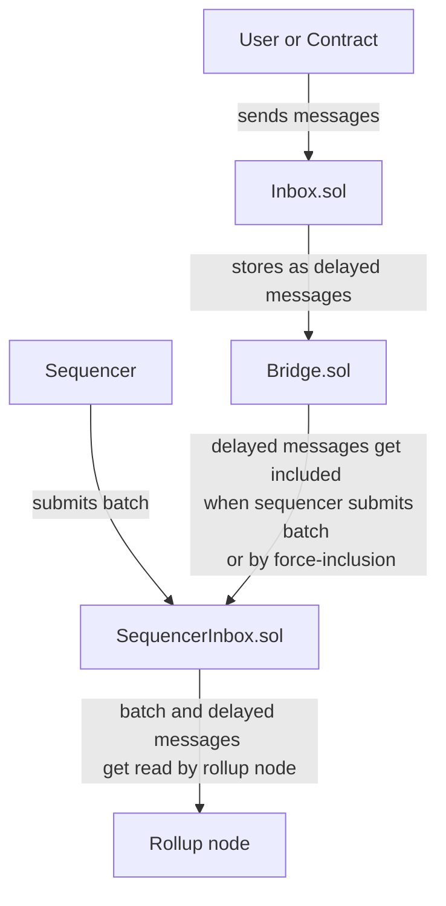

```mermaid
flowchart TB
    uc[User or Contract]
    Sequencer --submits batch --> sinbox[SequencerInbox.sol]
    inbox[Inbox.sol]
    uc --sends messages--> inbox
    inbox -->| stores as delayed messages | bridge[Bridge.sol]
    bridge --delayed messages get included </br> when sequencer submits batch </br> or by force-inclusion--> sinbox
    sinbox -- batch and delayed messages </br>get read by rollup node-->rollupnode[Rollup node] 
```