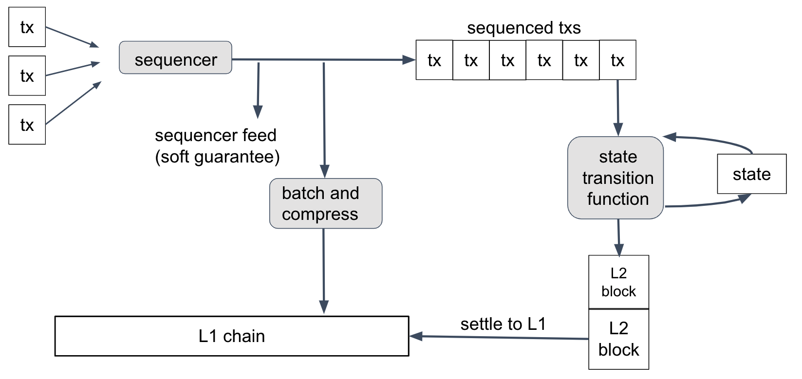
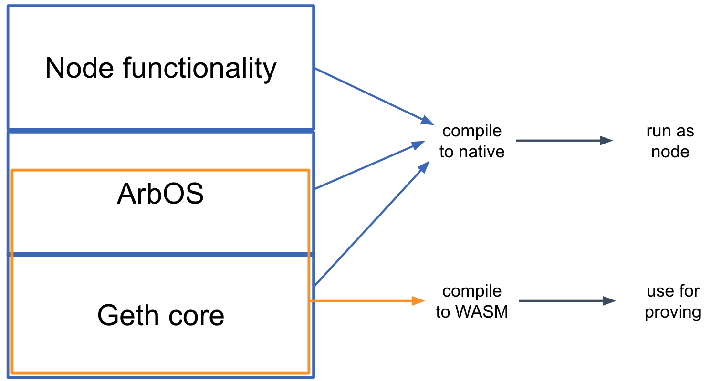

---

---

# Inside Arbitrum Nitro

This document is a deep-dive explanation of Arbitrum Nitro’s design and the rationale for it. This isn’t API documentation, nor is it a guided tour of the code--look elsewhere for those. “Inside Arbitrum Nitro” is for people who want to understand Nitro's design.

The body of this document will describe Arbitrum Rollup, the primary use case of the Nitro technology and the one used on the Arbitrum One chain. There is a variant use case, called AnyTrust, which is used by the Arbitrum Nova chain. AnyTrust is covered by a section at the end of this document.

## Why use Arbitrum? Why use Nitro?

Arbitrum is an L2 scaling solution for Ethereum, offering a unique combination of benefits:

- Trustless security: security rooted in Ethereum, with any one party able to ensure correct Layer 2 results
- Compatibility with Ethereum: able to run unmodified EVM contracts and unmodified Ethereum transactions
- Scalability: moving contracts’ computation and storage off of the main Ethereum chain, allowing much higher throughput
- Minimum cost: designed and engineered to minimize the L1 gas footprint of the system, minimizing per-transaction cost.

Some other Layer 2 systems provide some of these features, but to our knowledge no other system offers the same combination of features at the same cost.

Nitro is a major upgrade to Arbitrum, improving over "classic" Arbitrum in several ways:

* **Advanced Calldata Compression,** which further drives down transaction costs on Arbitrum by reducing the amount of data posted to L1.
* **Separate Contexts For Common Execution and Fault Proving,** increasing the performance of L1 nodes, and thus offering lower fees.
* **Ethereum L1 Gas Compatibility,** bringing pricing and accounting for EVM operations perfectly in line with Ethereum.
* **Additional L1 Interoperability,** including tighter synchronization with L1 Block numbers, and full support for all Ethereum L1 precompiles.
* **Safe Retryables,** eliminating the failure mode where a retryable ticket fails to get created.
* **Geth Tracing,** for even broader debugging support.
* And many, many more changes.

## The Big Picture

At the most basic level, an Arbitrum chain works like this:

People and contracts put messages into the inbox. The chain reads the messages one at a time, and processes each one. This updates the state of the chain and produces some outputs.

If you want an Arbitrum chain to process a transaction for you, you need to put that transaction into the chain’s inbox. Then the chain will see your transaction, execute it, and produce some outputs: a transaction receipt, and any withdrawals that your transaction initiated.

Execution is deterministic -- which means that the chain’s behavior is uniquely determined by the contents of its inbox. Because of this, the result of your transaction is knowable as soon as your transaction has been put in the inbox. Any Arbitrum node will be able to tell you the result. (And you can run an Arbitrum node yourself if you want.)

All of the technical detail in this document is connected to this diagram. To get from this diagram to a full description of Arbitrum, we’ll need to answer questions like these:

- Who keeps track of the inbox, chain state, and outputs?
- How does Arbitrum make sure that the chain state and outputs are correct?
- How can Ethereum users and contracts interact with Arbitrum?
- How does Arbitrum support Ethereum-compatible contracts and transactions?
- How are ETH and tokens transferred into and out of Arbitrum chains, and how are they managed while on the chain?
- How can I run my own Arbitrum node or validator?

## Nitro's Design: The Four Big Ideas

The essence of Nitro, and its key innovations, lie in four big ideas. We'll list them here with a very quick summary of each, then we'll unpack them in more detail in later sections.

**Big Idea: Sequencing, Followed by Deterministic Execution**: Nitro processes transactions with a two-phase strategy. First, the transactions are organized into a single ordered sequence, and Nitro commits to that sequence. Then the transactions are processed, in that sequence, by a deterministic state transition function.

**Big Idea: Geth at the Core**: Nitro supports Ethereum's data structures, formats, and virtual machine by compiling in the core code of the popular go-ethereum ("geth") Ethereum node software. Using geth as a library in this way ensures a very high degree of compatibility with Ethereum.

**Big Idea: Separate Execution from Proving**: Nitro takes the same source code and compiles it twice, once to native code for execution in a Nitro node, optimized for speed, and again to WASM for use in proving, optimized for portability and security. 

**Big Idea: Optimistic Rollup with Interactive Fraud Proofs**: Nitro settles transactions to the Layer 1 Ethereum chain using an optimistic rollup protocol, including the interactive fraud proofs pioneered by Arbitrum.

## Sequencing, Followed by Deterministic Execution

This diagram summarizes how transactions are processed in Nitro.

Let's follow a user's transaction through this process.

First, the user creates a transaction, uses their wallet to sign it, and sends it to the Nitro chain's Sequencer. The Sequencer's job, as its name implies, is to take the arriving transactions, put them into an ordered sequence, and publish that sequence.

Once the transactions are sequenced, they are run through the *state transition function*, one by one, in order. The state transition function takes as input the current state of the chain (account balances, contract code, and so on), along with the next transaction. It updates the state and sometimes emits a new Layer 2 block on the Nitro chain.

Because the protocol doesn't trust the Sequencer not to put garbage into its sequence, the state transition function will detect and discard any invalid (e.g., improperly formed) transactions in the sequence. A well-behaved Sequencer will filter out invalid transactions so the state transition function never sees them--and this reduces cost and therefore keeps transactions fees low--but Nitro will still work correctly no matter what the Sequencer puts into its feed. (Transactions in the feed are signed by their senders, so the Sequencer can't create forged transactions.)

The state transition function is deterministic, which means that its behavior depends only on the current state and the contents of the next transaction--and nothing else. Because of this determinism, the result of a transaction T will depend only on the genesis state of the chain, the transactions before T in the sequence, and T itself. 

It follows that anyone who knows the transaction sequence can compute the state transition function for themselves--and all honest parties who do this are guaranteed to get identical results. This is the normal way that Nitro nodes operate: get the transaction sequence, and run the state transition function locally. No consensus mechanism is needed for this.

### How the Sequencer Publishes the Sequence

So how do nodes get the sequence? The Sequencer publishes it in two ways: a real-time feed, and batches posted on L1 Ethereum.

The real-time feed is published by the Sequencer so that anyone who subscribes to the feed receives instant notifications of each transaction as it is sequenced. Nitro nodes can subscribe to the feed directly from the Sequencer, or through a relay that forwards the feed. The feed represents the Sequencer's promise that it will record transactions in a particular order. If the Sequencer is honest and doesn't have a long downtime, this promise will be kept. So anyone who trusts the Sequencer to keep its promises can rely on the feed to get instant information about the transaction sequence--and they can run the sequenced transactions through the state transition function to learn the results of each transaction immediately. This is "soft finality" for transactions; it's "soft" because it depends on the Sequencer keeping its promises.

The Sequencer also publishes its sequence on the L1 Ethereum chain. Periodically--perhaps every few minutes in production--the Sequencer concatenates the next group of transactions in the feed, compresses them for efficiency, and posts the result as calldata on Ethereum. This is the final and official record of the transaction sequence. As soon as this Ethereum transaction has finality on Ethereum, the Layer 2 Nitro transactions it records will have finality. These transactions are final because their position in the sequence has finality, and the outcome of the transactions is deterministic and knowable to any party. This is "hard finality".

The Sequencer's batches are compressed using a general-purpose data compression algorithm called "brotli", on its highest-compression setting.

## Geth at the Core

The second key design idea in Nitro is "geth at the core." Here "geth" refers to go-ethereum, the most common node software for Ethereum. As its name would suggest, go-ethereum is written in the Go programming language, as is almost all of Nitro.

The software that makes up a Nitro node can be thought of as built in three main layers, which are shown above:

* The base layer is the core of geth--the parts of geth that emulate the execution of EVM contracts and maintain the data structures that make up the Ethereum state. Nitro compiles in this code as a library, with a few minor modifications to add necessary hooks.
* The middle layer, which we call ArbOS, is custom software that provides additional functions associated with Layer 2 functionality, such as decompressing and parsing the Sequencer's data batches, accounting for Layer 1 gas costs and collecting fees to reimburse for them, and supporting cross-chain bridge functionalities such as deposits of Ether and tokens from L1 and withdrawals of the same back to L1. We'll dig in to the details of ArbOS below.
* The top layer consists of node software, mostly drawn from geth. This handles connections and incoming RPC requests from clients and provides the other top-level functionality required to operate an Ethereum-compatible blockchain node.

Because the top and bottom layers rely heavily on code from geth, this structure has been dubbed a "geth sandwich." Strictly speaking, geth plays the role of the bread in the sandwich, and ArbOS is the filling, but this sandwich is named for the bread.

The State Transition Function consists of the bottom geth layer, and a portion of the middle ArbOS layer. In particular, the STF is a designated function in the source code, and implicitly includes all of the code called by that function. The STF takes as input the bytes of a transaction received in the inbox, and has access to a modifiable copy of the Ethereum state tree. Executing the STF may modify the state, and at the end will emit the header of a new block (in Ethereum's block header format) which will be appended to the Nitro chain.

## Separating Execution from Proving

One of the challenges in designing a practical rollup system is the tension between wanting the system to perform well in ordinary execution, versus being able to reliably prove the results of execution. Nitro resolves this tension by using the same source code for both execution and proving, but compiling it to different targets for the two cases.

When compiling the Nitro node software for *execution*, the ordinary Go compiler is used, producing native code for the target architecture, which of course will be different for different node deployments. (The node software is distributed in source code form, and as a Docker image containing a compiled binary.)

Separately, for *proving*, the portion of the code that is the State Transition Function is compiled by the Go compiler to WebAssembly (wasm), which is a typed, portable machine code format. The wasm code then goes through a simple transformation into a format we call WAVM, which is detailed below. If there is a dispute about the correct result of computing the STF, it is resolved with reference to the WAVM code.

#### WAVM

The wasm format has many features that make it a good vehicle for fraud proofs---it is portable, structured, well-specified, and has reasonably good tools and support---but it needs a few modifications to do the job completely. Nitro uses a slightly modified version of wasm, which we call WAVM. A simple transformation stage turns the wasm code produced by the Go compiler into WAVM code suitable for proving.

WAVM differs from wasm in three main ways. First, WAVM removes some features of wasm that are not generated by the Go compiler; the transformation phase verifies that these features are not present. 

Second, WAVM restricts a few features of wasm. For example, WAVM does not contain floating-point instructions, so the transformer replaces floating-point instructions with calls to the Berkeley SoftFloat library. (We use software floating-point to reduce the risk of floating-point incompatibilities between architectures. The core Nitro functions never use floating-point, but the Go runtime does use some floating-point operations.) WAVM does not contain nested control flow, so the transformer flattens control flow constructs, turning control flow instructions into jumps. Some wasm instructions take a variable amount of time to execute, which we avoid in WAVM by transforming them into constructs using fixed cost instructions. These transformations simplify proving.

Third, WAVM adds a few opcodes to enable interaction with the blockchain environment. For example, new instructions allow the WAVM code to read and write the chain's global state, to get the next message from the chain's inbox, or to signal a successful end to executing the State Transition Function.

#### ReadPreImage and the Hash Oracle Trick

The most interesting new instruction is `ReadPreImage` which takes as input a hash `H` and an offset `I`, and returns the word of data at offset `I` in the preimage of `H` (and the number of bytes written, which is zero if `I` is at or after the end of the preimage). Of course, it is not feasible in general to produce a preimage from an arbitrary hash. For safety, the `ReadPreImage` instruction can only be used in a context where the preimage is publicly known, and where the size of the preimage is known to be less than a fixed upper bound of about 110 kbytes. 

(In this context, "publicly known" information is information that can be derived or recovered efficiently by any honest party, assuming that the full history of the L1 Ethereum chain is available. For convenience, a hash preimage can also be supplied by a third party such as a public server, and the correctness of the supplied value is easily verified.)

As an example, the state of a Nitro chain is maintained in Ethereum's state tree format, which is organized as a Merkle tree. Nodes of the tree are stored in a database, indexed by the Merkle hash of the node. In Nitro, the state tree is kept outside of the State Transition Function's storage, with the STF only knowing the root hash of the tree.  Given the hash of a tree node, the STF can recover the tree node's contents by using `ReadPreImage`, relying on the fact that the full contents of the tree are publicly known and that nodes in the Ethereum state tree will always be smaller than the upper bound on preimage size. In this manner, the STF is able to arbitrarily read and write to the state tree, despite only storing its root hash.

The only other use of `ReadPreImage` is to fetch the contents of recent L2 block headers, given the header hash. This is safe because the block headers are publicly known and have bounded size.

This "hash oracle trick" of storing the Merkle hash of a data structure, and relying on protocol participants to store the full structure and thereby support fetch-by-hash of the contents, goes back to the original Arbitrum design.

## Optimistic Rollup

Arbitrum is an optimistic rollup. Let’s unpack that term.

_Rollup_

Arbitrum is a rollup, which means that the inputs to the chain -- the messages that are put into the inbox -- are all recorded on the Ethereum chain as calldata. Because of this, everyone has the information they would need to determine the current correct state of the chain -- they have the full history of the inbox, and the results are uniquely determined by the inbox history, so they can reconstruct the state of the chain based only on public information, if needed.

This also allows anyone to be a full participant in the Arbitrum protocol, to run an Arbitrum node or participate as a validator. Nothing about the history or state of the chain is a secret.

_Optimistic_

Arbitrum is optimistic, which means that Arbitrum advances the state of its chain by letting any party (a “validator”) post on Layer 1 a rollup block that that party claims is correct, and then giving everyone else a chance to challenge that claim. If the challenge period (roughly a week) passes and nobody has challenged the claimed rollup block, Arbitrum confirms the rollup block as correct. If someone challenges the claim during the challenge period, then Arbitrum uses an efficient dispute resolution protocol (detailed below) to identify which party is lying. The liar will forfeit a deposit, and the truth-teller will take part of that deposit as a reward for their efforts (some of the deposit is burned, guaranteeing that the liar is punished even if there's some collusion going on).

Because a party who tries to cheat will lose a deposit, attempts to cheat should be very rare, and the normal case will be a single party posting a correct rollup block, and nobody challenging it.

## Resolving disputes using interactive fraud proofs

Among optimistic rollups, the most important design decision is how to resolve disputes. Suppose Alice claims that the chain will produce a certain result, and Bob disagrees. How will the protocol decide which version to accept?

There are basically two choices: interactive proving, or re-executing transactions. Arbitrum uses interactive proving, which we believe is more efficient and more flexible. Much of the design of Arbitrum follows from this fact.

### Interactive proving

The idea of interactive proving is that Alice and Bob will engage in a back-and-forth protocol, refereed by an L1 contract, to resolve their dispute with minimal work required from any L1 contract.

Arbitrum's approach is based on dissection of the dispute. If Alice's claim covers N steps of execution, she posts two claims of size N/2 which combine to yield her initial N-step claim, then Bob picks one of Alice's N/2-step claims to challenge. Now the size of the dispute has been cut in half. This process continues, cutting the dispute in half at each stage, until they are disagreeing about a single step of execution. Note that so far the L1 referee hasn't had to think about execution "on the merits". It is only once the dispute is narrowed down to a single step that the L1 referee needs to resolve the dispute by looking at what the instruction actually does and whether Alice's claim about it is correct.

The key principle behind interactive proving is that if Alice and Bob are in a dispute, Alice and Bob should do as much off-chain work as possible needed to resolve their dispute, rather than putting that work onto an L1 contract.

### Re-executing transactions

The alternative to interactive proving would be to have a rollup block contain a claimed machine state hash after every individual transaction. Then in case of a dispute, the L1 referee would emulate the execution of an entire transaction, to see whether the outcome matches Alice's claim.

### Why interactive proving is better

We believe strongly that interactive proving is the superior approach, for the following reasons.

**More efficient in the optimistic case**: Because interactive proving can resolve disputes that are larger than one transaction, it can allow a rollup block to contain only a single claim about the end state of the chain after all of the execution covered by the block. By contrast, reexecution requires posting a state claim for each transaction within the rollup block. With hundred or thousands of transactions per rollup block, this is a substantial difference in L1 footprint -- and L1 footprint is the main component of cost.

**More efficient in the pessimistic case**: In case of a dispute, interactive proving requires the L1 referee contract only to check that Alice and Bob's actions "have the right shape", for example, that Alice has divided her N-step claim into two claims half as large. (The referee doesn't need to evaluate the correctness of Alice's claims--Bob does that, off-chain.) Only one instruction needs to be reexecuted. By contrast, reexecution requires the L1 referee to emulate the execution of an entire transaction.

**Higher per-tx gas limit:** Interactive proving can escape from Ethereum's tight per-transaction gas limit. The gas limit isn't infinite, for obvious reasons, but it can be larger than on Ethereum. As far as Ethereum is concerned, the only downside of a gas-heavy Arbitrum transaction is that it may require an interactive fraud proof with slightly more steps (and only if indeed it is fraudulent). By contrast, reexecution must impose a _lower_ gas limit than Ethereum, because it must be possible to emulate execution of the transaction (which is more expensive than executing it directly) within a single Ethereum transaction.

**More implementation flexibility:** Interactive proving allows more flexibility in implementation. All that is necessary is the ability to verify a one-step proof on Ethereum. By contrast, reexecution approaches are tethered to limitations of the EVM.

### Interactive proving drives the design of Arbitrum

Much of the design of Arbitrum is driven by the opportunities opened up by interactive proving. If you're reading about some feature of Arbitrum, and you're wondering why it exists, two good questions to ask are: "How does this support interactive proving?" and "How does this take advantage of interactive proving?" The answers to most "why questions" about Arbitrum relate to interactive proving.

## Arbitrum Rollup Protocol

Before diving into the rollup protocol, there are two things we need to cover.

First, _if you’re an Arbitrum user or developer, you don’t need to understand the rollup protocol_. You don’t ever need to think about it, unless you want to. Your relationship with it can be like a train passenger’s relationship with the train’s engine: you know it exists, you rely on it to keep working, but you don’t spend your time monitoring it or studying its internals.

You’re welcome to study, observe, and even participate in the rollup protocol, but you don’t need to, and most people won’t. So if you’re a typical train passenger who just wants to read or talk to your neighbor, you can skip right to the [next section](#validators) of this document. If not, read on!

The second thing to understand about the rollup protocol is that *the protocol doesn’t decide the results of transactions, it only confirms the results*. The results are uniquely determined by the sequence of messages in the chain’s inbox. So once your transaction message is in the chain’s inbox, its result is knowable--and Arbitrum nodes will report that your transaction is done. The role of the rollup protocol is to confirm transaction results that, as far as Arbitrum users are concerned, have already occurred. (This is why Arbitrum users can effectively ignore the rollup protocol.)

You might wonder why we need the rollup protocol. If everyone knows the results of transactions already, why bother confirming them? The rollup protocol exists for two reasons. First, somebody might lie about a result, and we need a definitive, trustless way to tell who is lying. Second, Ethereum doesn’t know the results. The whole point of a Layer 2 scaling system is to run transactions without Ethereum needing to do all of the work--and indeed Arbitrum can go fast enough that Ethereum couldn’t hope to monitor every Arbitrum transaction. But once a result is confirmed, Ethereum knows about it and can rely on it, enabling operations on Ethereum such as processing withdrawals of funds from Nitro back to L1.

With those preliminaries behind us, let’s jump into the details of the rollup protocol.

The parties who participate in the protocol are called _validators_. Some validators will choose to be stakers--they will place an ETH deposit which they’ll be able to recover if they’re not caught cheating. In the common case, it's expected that only one validator will be staked, since as long as it's staked on the current outcome, and there are no conflicting claims, there's no need for other parties to stake / take any action. The protocol allows for these roles to be permissionless in principle; currently on Arbitrum One, validators/stakers are whitelisted (see ["mainnet beta status"](../mainnet-beta.md)). "Watchtower validators," who monitor the chain but don't take any on-chain actions, can be run permissionlessly (see ["validators"](#validators) below). 

The key security property of the rollup protocol is that any one honest validator can force the correct execution of the chain to be confirmed. This means that execution of an Arbitrum chain is as trustless as Ethereum. You, and you alone (or someone you hire) can force your transactions to be processed correctly. And that is true no matter how many malicious people are trying to stop you.

### The Rollup Chain

The rollup protocol tracks a chain of rollup blocks---we'll call these "RBlocks" for clarity. They're not the same as Layer 1 Ethereum blocks, and also not the same as Layer 2 Nitro blocks. You can think of the RBlocks as forming a separate chain, which the Arbitrum rollup protocol manages and oversees.

Validators can propose RBlocks. New RBlocks will be _unresolved_ at first. Eventually every RBlock will be _resolved_, by being either _confirmed_ or _rejected_. The confirmed RBlocks make up the confirmed history of the chain.

Each RBlock contains:

- the RBlock number
- the predecessor RBlock number: RBlock number of the last RBlock before this one that is (claimed to be) correct
- the number of L2 blocks that have been created in the chain's history
- the number of inbox messages have been consumed in the chain’s history
- a hash of the outputs produced over the chain’s history.

Except for the RBlock number, the contents of the RBlock are all just claims by the RBlock's proposer. Arbitrum doesn’t know at first whether any of these fields are correct. If all of these fields are correct, the protocol should eventually confirm the RBlock. If one or more of these fields are incorrect, the protocol should eventually reject the RBlock.

An RBlock is implicitly claiming that its predecessor RBlock is correct. This implies, transitively, that an RBlock implicitly claims the correctness of a complete history of the chain: a sequence of ancestor RBlock that reaches all the way back to the birth of the chain.

An RBlock is also implicitly claiming that its older siblings (older RBlocks with the same predecessor), if there are any, are incorrect. If two RBlocks are siblings, and the older sibling is correct, then the younger sibling is considered incorrect, even if everything else in the younger sibling is true.

The RBlock is assigned a deadline, which says how long other validators have to respond to it. If you’re a validator, and you agree that an RBlock is correct, you don’t need to do anything. If you disagree with an RBlock, you can post another RBlock with a different result, and you’ll probably end up in a challenge against the first RBlock's staker. (More on challenges below.)

In the normal case, the rollup chain will look like this:

On the left, representing an earlier part of the chain’s history, we have confirmed RBlocks. These have been fully accepted and recorded by the Layer 1 contracts that manage the chain. The newest of the confirmed RBlocks, RBlock 94, is called the “latest confirmed RBlock.” On the right, we see a set of newer proposed RBlocks. The protocol can’t yet confirm or reject them, because their deadlines haven’t run out yet. The oldest RBlock whose fate has yet to be determined, RBlock 95, is called the “first unresolved RBlock.”

Notice that a proposed RBlock can build on an earlier proposed RBlock. This allows validators to continue proposing RBlocks without needing to wait for the protocol to confirm the previous one. Normally, all of the proposed RBlocks will be valid, so they will all eventually be accepted.

Here’s another example of what the chain state might look like, if several validators are being malicious. It’s a contrived example, designed to illustrate a variety of cases that can come up in the protocol, all smashed into a single scenario.

There’s a lot going on here, so let’s unpack it.

- RBlock 100 has been confirmed.
- RBlock 101 claimed to be a correct successor to RBlock 100, but 101 was rejected (hence the X drawn in it).
- RBlock 102 was eventually confirmed as the correct successor to 100.
- RBlock 103 was confirmed and is now the latest confirmed RBlock.
- RBlock 104 was proposed as a successor to RBlock 103, and 105 was proposed as a successor to 104. 104 was rejected as incorrect, and as a consequence 105 was rejected because its predecessor was rejected.
- RBlock 106 is unresolved. It claims to be a correct successor to RBlock 103 but the protocol hasn’t yet decided whether to confirm or reject it. It is the first unresolved RBlock.
- RBlocks 107 and 108 claim to chain from 106. They are also unresolved. If 106 is rejected, they will be automatically rejected too.
- RBlock 109 disagrees with RBlock 106, because they both claim the same predecessor. At least one of them will eventually be rejected, but the protocol hasn’t yet resolved them.
- RBlock 110 claims to follow 109. It is unresolved. If 109 is rejected, 110 will be automatically rejected too.
- RBlock 111 claims to follow 105. 111 will inevitably be rejected because its predecessor has already been rejected. But it hasn’t been rejected yet, because the protocol resolves RBlocks in RBlock number order, so the protocol will have to resolve 106 through 110, in order, before it can resolve 111. After 110 has been resolved, 111 can be rejected immediately.

Again: this sort of thing is very unlikely in practice. In this diagram, at least four parties must have staked on wrong RBlocks, and when the dust settles at least four parties will have lost their stakes. The protocol handles these cases correctly, of course, but they’re rare corner cases. This diagram is designed to illustrate the variety of situations that are possible in principle, and how the protocol would deal with them.

### Staking

At any given time, some validators will be stakers, and some will not. Stakers deposit funds that are held by the Arbitrum Layer 1 contracts and will be confiscated if the staker loses a challenge. Nitro chains accept stakes in ETH.

A single stake can cover a chain of RBlocks. Every staker is staked on the latest confirmed RBlock; and if you’re staked on an RBlock, you can also stake on one successor of that RBlock. So you might be staked on a sequence of RBlocks that represent a single coherent claim about the correct history of the chain. A single stake suffices to commit you to that sequence of RBlocks.

In order to create a new RBlock, you must be a staker, and you must already be staked on the predecessor of the new RBlock you’re creating. The stake requirement for RBlock creation ensures that anyone who creates a new RBlock has something to lose if that RBlock is eventually rejected.

The protocol keeps track of the current required stake amount. Normally this will equal the base stake amount, which is a parameter of the Nitro chain. But if the chain has been slow to make progress lately, the required stake will increase, as described in more detail below.

The rules for staking are as follows:

- If you’re not staked, you can stake on the latest confirmed RBlock. When doing this, you deposit the current minimum stake amount.
- If you’re staked on an RBlock, you can also add your stake to any one successor of that RBlock. (The protocol tracks the maximum RBlock number you’re staked on, and lets you add your stake to any successor of that RBlock, updating your maximum to that successor.) This doesn’t require you to place a new stake.
  - A special case of adding your stake to a successor RBlock is when you create a new RBlock as a successor to an RBlock you’re already staked on.
- If you’re staked only on the latest confirmed RBlock (and possibly earlier RBlocks), you or anyone else can ask to have your stake refunded. Your staked funds will be returned to you, and you will no longer be a staker.
- If you lose a challenge, your stake is removed from all RBlocks and you forfeit your staked funds.

Notice that once you are staked on an RBlock, there is no way to unstake. You are committed to that RBlock. Eventually one of two things will happen: that RBlock will be confirmed, or you will lose your stake. The only way to get your stake back is to wait until all of the RBlocks you are staked on are confirmed.

#### Setting the current minimum stake amount

One detail we deferred earlier is how the current minimum stake amount is set. Normally, this is just equal to the base stake amount, which is a parameter of the Nitro chain. However, if the chain has been slow to make progress in confirming RBlocks, the stake requirement will escalate temporarily. Specifically, the base stake amount is multiplied by a factor that is exponential in the time since the deadline of the first unresolved RBlock passed. This ensures that if malicious parties are placing false stakes to try to delay progress (despite the fact that they’re losing those stakes), the stake requirement goes up so that the cost of such a delay attack increases exponentially. As RBlock resolution starts advancing again, the stake requirement will go back down.

### Rules for Confirming or Rejecting RBlocks

The rules for resolving RBlocks are fairly simple.

The first unresolved RBlock can be confirmed if:

- the RBlock's predecessor is the latest confirmed RBlock, and
- the RBlock's deadline has passed, and
- there is at least one staker, and
- all stakers are staked on the RBlock.

The first unresolved RBlock can be rejected if:

- the RBlock's predecessor has been rejected, or
- all of the following are true:
  - the RBlock's deadline has passed, and
  - there is at least one staker, and
  - no staker is staked on the RBlock.

A consequence of these rules is that once the first unresolved RBlock's deadline has passed (and assuming there is at least one staker staked on something other than the latest confirmed RBlock), the only way the RBlock can be unresolvable is if at least one staker is staked on it and at least one staker is staked on a different RBlock with the same predecessor. If this happens, the two stakers are disagreeing about which RBlock is correct. It’s time for a challenge, to resolve the disagreement.

## Challenges

Suppose the rollup chain looks like this:

RBlocks 93 and 95 are siblings (they both have 92 as predecessor). Alice is staked on 93 and Bob is staked on 95.

At this point we know that Alice and Bob disagree about the correctness of RBlock 93, with Alice committed to 93 being correct and Bob committed to 93 being incorrect. (Bob is staked on 95, and 95 implicitly claims that 92 is the last correct RBlock before it, which implies that 93 must be incorrect.)

Whenever two stakers are staked on sibling RBlocks, and neither of those stakers is already in a challenge, anyone can start a challenge between the two. The rollup protocol will record the challenge and referee it, eventually declaring a winner and confiscating the loser’s stake. The loser will be removed as a staker.

The challenge is a game in which Alice and Bob alternate moves, with an Ethereum contract as the referee. Alice, the defender, moves first.

The game will operate in two phases: dissection, followed by one-step proof. Dissection will narrow down the size of the dispute until it is a dispute about just one instruction of execution. Then the one-step proof will determine who is right about that one instruction.

We’ll describe the dissection part of the protocol twice. First, we’ll give a simplified version which is easier to understand but less efficient. Then we’ll describe how the real version differs from the simplified one.

### Dissection Protocol: Simplified Version

Alice is defending the claim that starting with the state in the predecessor RBlock, the state of the Virtual Machine can advance to the state specified in RBlock A. Essentially she is claiming that the Virtual Machine can execute N instructions, and that that execution will consume M inbox messages and transform the hash of outputs from H’ to H.

Alice’s first move requires her to dissect her claims about intermediate states between the beginning (0 instructions executed) and the end (N instructions executed). So we require Alice to divide her claim in half, and post the state at the half-way point, after N/2 instructions have been executed.

Now Alice has effectively bisected her N-step assertion into two (N/2)-step assertions. Bob has to point to one of those two half-size assertions and claim it is wrong.

At this point we’re effectively back in the original situation: Alice having made an assertion that Bob disagrees with. But we have cut the size of the assertion in half, from N to N/2. We can apply the same method again, with Alice bisecting and Bob choosing one of the halves, to reduce the size to N/4. And we can continue bisecting, so that after a logarithmic number of rounds Alice and Bob will be disagreeing about a single step of execution. That’s where the dissection phase of the protocol ends, and Alice must make a one-step proof which will be checked by the EthBridge.

### Why Dissection Correctly Identifies a Cheater

Before talking about the complexities of the real challenge protocol, let’s stop to understand why the simplified version of the protocol is correct. Here correctness means two things: (1) if Alice’s initial claim is correct, Alice can always win the challenge, and (2) if Alice’s initial claim is incorrect, Bob can always win the challenge.

To prove (1), observe that if Alice’s initial claim is correct, she can offer a truthful midpoint claim, and both of the implied half-size claims will be correct. So whichever half Bob objects to, Alice will again be in the position of defending a correct claim. At each stage of the protocol, Alice will be defending a correct claim. At the end, Alice will have a correct one-step claim to prove, so that claim will be provable and Alice can win the challenge.

To prove (2), observe that if Alice’s initial claim is incorrect, this can only be because her claimed endpoint after N steps is incorrect. Now when Alice offers her midpoint state claim, that midpoint claim is either correct or incorrect. If it’s incorrect, then Bob can challenge Alice’s first-half claim, which will be incorrect. If Alice’s midpoint state claim is correct, then her second-half claim must be incorrect, so Bob can challenge that. So whatever Alice does, Bob will be able to challenge an incorrect half-size claim. At each stage of the protocol, Bob can identify an incorrect claim to challenge. At the end, Alice will have an incorrect one-step claim to prove, which she will be unable to do, so Bob can win the challenge.

(If you’re a stickler for mathematical precision, it should be clear how these arguments can be turned into proofs by induction on N.)

### The Real Dissection Protocol

The real dissection protocol is conceptually similar to the simplified one described above, but with several changes that improve efficiency or deal with necessary corner cases. Here is a list of the differences.

**Dissection over L2 blocks, then over instructions:** Alice's assertion is over an RBlock, which asserts the result of creating some number of Layer 2 Nitro blocks. Dissection first occurs over these Layer 2 blocks, to narrow the dispute down to a dispute about a single Layer 2 Nitro block. At this point, the dispute transforms into a dispute about a single execution of the State Transition Function or in other words about the execution of a sequence of WAVM instructions. The protocol then executes the recursive dissection sub-protocol again, this time over WAVM instructions, to narrow the dispute to a single instruction. The dispute concludes with a one-step proof of a single instruction (or a party failing to act and losing by timeout).

**K-way dissection:** Rather than dividing a claim into two segments of size N/2, we divide it into K segments of size N/K. This requires posting K-1 intermediate claims, at points evenly spaced through the claimed execution. This reduces the number of rounds by a factor of log(K)/log(2).

**Answer a dissection with a dissection:** Rather than having each round of the protocol require two moves, where Alice dissects and Bob chooses a segment to challenge, we instead require Bob, in challenging a segment, to post his own claimed endpoint state for that segment (which must differ from Alice’s) as well as his own dissection of his version of the segment. Alice will then respond by identifying a subsegment, posting an alternative endpoint for that segment, and dissecting it. This reduces the number of moves in the game by an additional factor of 2, because the size is cut by a factor of K for every move, rather than for every two moves.

**Deal With the Empty-Inbox Case**: The real AVM can’t always execute N ArbGas units without getting stuck. The machine might halt, or it might have to wait because its inbox is exhausted so it can’t go on until more messages arrive. So Bob must be allowed to respond to Alice’s claim of N units of execution by claiming that N steps are not possible. The real protocol thus allows any response (but not the initial claim) to claim a special end state that means essentially that the specified amount of execution is not possible under the current conditions.

**Time Limits:** Each player is given a time allowance. The total time a player uses for all of their moves must be less than the time allowance, or they lose the game. Think of the time allowance as being about a week.

It should be clear that these changes don’t affect the basic correctness of the challenge protocol. They do, however, improve its efficiency and enable it to handle all of the cases that can come up in practice.

### Efficiency

The challenge protocol is designed so that the dispute can be resolved with a minimum of work required by the protocol (via its Layer 1 Ethereum contracts) in its role as referee. When it is Alice’s move, the protocol only needs to keep track of the time Alice uses, and ensure that her move does include K-1 intermediate points as required. The protocol doesn’t need to pay attention to whether those claims are correct in any way; it only needs to know whether Alice’s move “has the right shape”.

The only point where the protocol needs to evaluate a move “on the merits” is at the one-step proof, where it needs to look at Alice’s proof and determine whether the proof that was provided does indeed establish that the virtual machine moves from the before state to the claimed after state after one step of computation.

## Validators

Some Arbitrum nodes will choose to act as _validators_. This means that they watch the progress of the rollup protocol and participate in that protocol to advance the state of the chain securely.

Not all nodes will choose to do this. Because the rollup protocol doesn’t decide what the chain will do but merely confirms the correct behavior that is fully determined by the inbox messages, a node can ignore the rollup protocol and simply compute for itself the correct behavior. For more on what such nodes might do, see the [Full Nodes](#full-nodes) section.

Offchain Labs provides open source validator software, including a pre-built Docker image.

Every validator can choose their own approach, but we expect validators to follow three common strategies:

- The _active validator_ strategy tries to advance the state of the chain by proposing new RBlocks. An active validator is always staked, because creating an RBlock requires being staked. A chain really only needs one honest active validator; any more is an inefficient use of resources. For the Arbitrum One chain, Offchain Labs runs an active validator.
- The _defensive validator_ strategy watches the rollup protocol operate. If only correct RBlocks are proposed, this strategy doesn't stake. But if an incorrect RBlock is proposed, this strategy intervenes by posting a correct RBlock or staking on a correct RBlock that another party has posted. This strategy avoids staking when things are going well, but if someone is dishonest it stakes in order to defend the correct outcome.
- The _watchtower validator_ strategy never stakes. It simply watches the rollup protocol and if an incorrect RBlock is proposed, it raises the alarm (by whatever means it chooses) so that others can intervene. This strategy assumes that other parties who are willing to stake will be willing to intervene in order to take some of the dishonest proposer’s stake, and that that can happen before the dishonest RBlock’s deadline expires. (In practice this will allow several days for a response.)

Under normal conditions, validators using the defensive and watchtower strategies won’t do anything except observe. A malicious actor who is considering whether to try cheating won’t be able to tell how many defensive and watchtower validators are operating incognito. Perhaps some defensive validators will announce themselves, but others probably won’t, so a would-be attacker will always have to worry that defenders are waiting to emerge.

The underlying protocol supports permissionless validation, i.e.,--anyone can do it. Currently on Arbitrum One, validators that require stake (i.e., active and defensive validators) are whitelisted; see ["mainnet beta status"](../mainnet-beta.md).

Who will be validators? Anyone will be able to do it, but most people will choose not to. In practice we expect people to validate a chain for several reasons.

- Some validators will be paid, by the party that created the chain or someone else. A portion of the funds from user transaction fees are used to pay validators on Arbitrum One and Arbitrum Nova.
- Parties who have significant assets at stake on a chain, such as dapp developers, exchanges, power-users, and liquidity providers, may choose to validate in order to protect their investment.
- Anyone who chooses to validate can do so. Some users will probably choose to validate in order to protect their own interests or just to be good citizens. But ordinary users don’t need to validate, and we expect that the vast majority of users won’t.

## ArbOS

ArbOS is a trusted "system glue" component that runs at Layer 2 as part of the State Transition Function. ArbOS provides functions needed for a Layer 2 system, such as cross-chain communication, resource accounting and Layer 2 related fee economics, and chain management.

### Why ArbOS?

In Arbitrum, much of the work that would otherwise have to be done expensively at Layer 1 is instead done by ArbOS, trustlessly performing these functions at the speed and low cost of Layer 2.

Supporting these functions in Layer 2 trusted software, rather than building them in to the L1-enforced rules of the architecture as Ethereum does, offers significant advantages in cost because these operations can benefit from the lower cost of computation and storage at Layer 2, instead of having to manage those resources as part of a Layer 1 contract. Having a trusted operating system at Layer 2 also has significant advantages in flexibility, because Layer 2 code is easier to evolve, or to customize for a particular chain, than a Layer-1 enforced architecture would be.

## Full Nodes

As the name suggests, full nodes in Arbitrum play the same role that full nodes play in Ethereum: they know the state of the chain and they provide an API that others can use to interact with the chain.

Arbitrum full nodes normally "live at Layer 2" which means that they don’t worry about the rollup protocol but simply treat their Arbitrum chain as a mechanism that feeds inbox messages to the State Transition Function to evolve the Layer 2 chain and produce outputs. 

## The Sequencer

The Sequencer is a specially designated full node, which is given limited power to control the ordering of transactions. This allows the Sequencer to guarantee the results of user transactions immediately, without needing to wait for anything to happen on Ethereum. So no need to wait five minutes or so for block confirmations--and no need to even wait 15 seconds for Ethereum to make a block.

Clients interact with the Sequencer in exactly the same way they would interact with any full node, for example by giving their wallet software a network URL that happens to point to the Sequencer.

On the Arbitrum One and Arbitrum Nova chains, the Sequencer is run by Offchain Labs.

### Instant confirmation

Without a Sequencer, a node can predict what the results of a client transaction will be, but the node can't be sure, because it can't know or control how the transactions it submits will be ordered in the inbox, relative to transactions submitted by other nodes.

The Sequencer is given more control over ordering, so it has the power to assign its clients' transactions a position in the inbox queue, thereby ensuring that it can determine the results of client transactions immediately. The Sequencer's power to reorder has limits (see below for details) but it does have more power than anyone else to influence transaction ordering.

### Inboxes, fast and slow

When we add a Sequencer, the operation of the inbox changes.

* Only the Sequencer can put new messages directly into the inbox. The Sequencer tags the messages it is submitting with an Ethereum block number and timestamp. (ArbOS ensures that these are non-decreasing, adjusting them upward if necessary to avoid decreases.)
* Anyone else can submit a message, but messages submitted by non-Sequencer nodes will be put into the "delayed inbox" queue, which is managed by an L1 Ethereum contract.  
  * Messages in the delayed inbox queue will wait there until the Sequencer chooses to "release" them into the main inbox, where they will be added to the end of the inbox. A well-behaved Sequencer will typically release delayed messages after about ten minutes, for reasons explained below.
  * Alternatively, if a message has been in the delayed inbox queue for longer than a maximum delay interval (currently 24 hours) then anyone can force it to be promoted into the main inbox. (This ensures that the Sequencer can only delay messages but can't censor them.)

### If the Sequencer is well-behaved...

A well-behaved Sequencer will accept transactions from all requesters and treat them fairly, giving each one a promised transaction result as quickly as it can.

It will also minimize the delay it imposes on non-Sequencer transactions by releasing delayed messages promptly, consistent with the goal of providing strong promises of transaction results. Specifically, if the Sequencer believes that 40 confirmation blocks are needed to have good confidence of finality on Ethereum, then it will release delayed messages after 40 blocks. This is enough to ensure that the Sequencer knows exactly which transactions will precede its current transaction, because those preceding transactions have finality. There is no need for a benign Sequencer to delay non-Sequencer messages more than that, so it won't.

This does mean that transactions that go through the delayed inbox will take longer to get finality. Their time to finality will roughly double, because they will have to wait one finality period for promotion, then another finality period for the Ethereum transaction that promoted them to achieve finality.

This is the basic tradeoff of having a Sequencer: if your message uses the Sequencer, finality is C blocks faster; but if your message doesn't use the Sequencer, finality is C blocks slower. This is usually a good tradeoff, because most transactions will use the Sequencer; and because the practical difference between instant and 10-minute finality is bigger than the difference between 10-minute and 20-minute finality.

So a Sequencer is generally a win, if the Sequencer is well behaved.

### If the Sequencer is malicious...

A malicious Sequencer, on the other hand, could cause some pain. If it refuses to handle your transactions, you're forced to go through the delayed inbox, with longer delay. And a malicious Sequencer has great power to front-run everyone's transactions, so it could profit greatly at users' expense.

On Arbitrum One, Offchain Labs runs a Sequencer which is well-behaved--we promise!. This will be useful but it's not decentralized. Over time, we'll switch to decentralized, fair sequencing, as described below.

Because the Sequencer will be run by a trusted party at first, and will be decentralized later, we haven't built in a mechanism to directly punish a misbehaving Sequencer. We're asking users to trust the centralized Sequencer at first, until we switch to decentralized fair sequencing later.

### Decentralized fair sequencing

Viewed from 30,000 feet, decentralized fair sequencing isn't too complicated. Instead of being a single centralized server, the Sequencer is a committee of servers, and as long as a large enough supermajority of the committee is honest, the Sequencer will establish a fair ordering over transactions.

How to achieve this is more complicated. Research by a team at Cornell Tech, including Offchain Labs CEO and Co-founder Steven Goldfeder, developed the first-ever decentralized fair sequencing algorithm. With some improvements that are under development, these concepts will form the basis for our longer-term solution, of a fair decentralized Sequencer.

## Bridging

We have already covered how users interact with L2 contracts--they submit transactions by putting messages into the chain’s inbox, or having a full node Sequencer or aggregator do so on their behalf. Let’s talk about how contracts interact between L1 and L2--how an L1 contract calls an L2 contract, and vice versa.

The L1 and L2 chains run asynchronously from each other, so it is not possible to make a cross-chain call that produces a result within the same transaction as the caller. Instead, cross-chain calls must be asynchronous, meaning that the caller submits the call at some point in time, and the call runs later. As a consequence, a cross-chain contract-to-contract call can never produce a result that is available to the calling contract (except for acknowledgement that the call was successfully submitted for later execution).

### L1 contracts can submit L2 transactions

An L1 contract can submit an L2 transaction, just like a user would, by calling the Nitro chain's inbox contract on Ethereum. This L2 transaction will run later, producing results that will not be available to the L1 caller. The transaction will execute at L2, but the L1 caller won’t be able to see any results from the L2 transaction.

The advantage of this method is that it is simple and has relatively low latency. The disadvantage, compared to the other method we’ll describe soon, is that the L2 transaction might revert if the L1 caller doesn’t get the L2 gas price and max gas amount right. Because the L1 caller can’t see the result of its L2 transaction, it can’t be absolutely sure that its L2 transaction will succeed.

This would introduce a serious a problem for certain types of L1 to L2 interactions. Consider a transaction that includes depositing a token on L1 to be made available at some address on L2. If the L1 side succeeds, but the L2 side reverts, you've just sent some tokens to the L1 inbox contract that are unrecoverable on either L2 or L1. Not good.

### L1 to L2 ticket-based transactions

Fortunately, we have another method for L1 to L2 calls, which is more robust against gas-related failures, that uses a ticket-based system. The idea is that an L1 contract can submit a “retryable” transaction. The Nitro chain will try to run that transaction. If the transaction succeeds, nothing else needs to happen. But if the transaction fails, Nitro will create a “ticketID” that identifies that failed transaction. Later, anyone can call a special pre-compiled contract at L2, providing the ticketID, to try redeeming the ticket and re-executing the transaction.

When saving a transaction for retry, Nitro records the sender’s address, destination address, callvalue, and calldata. All of this is saved, and the callvalue is deducted from the sender’s account and (logically) attached to the saved transaction.

If the redemption succeeds, the transaction is done, a receipt is issued for it, and the ticketID is canceled and can’t be used again. If the redemption fails, for example because the packaged transaction fails, the redemption reports failure and the ticketID remains available for redemption.

Normally the original submitter will try to cause their transaction to succeed immediately, so it never needs to be recorded or retried. As an example, our "token deposit" use case above should, in the happy, common case, still only require a single signature from the user. If this initial execution fails, the ticketID will still exist as a backstop which others can redeem later.

Submitting a transaction in this way carries a price in ETH which the submitter must pay, which varies based on the calldata size of the transaction. Once submitted, the ticket is valid for about a week. If the ticket has not been redeemed in that period, it is deleted.

When the ticket is redeemed, the pre-packaged transaction runs with sender and origin equal to the original submitter, and with the destination, callvalue, and calldata the submitter provided at the time of submission. 

This mechanism is a bit more cumbersome than ordinary L1 to L2 transactions, but it has the advantage that the submission cost is predictable and the ticket will always be available for redemption if the submission cost is paid. As long as there is some user who is willing to redeem the ticket, the L2 transaction will eventually be able to execute and will not be silently dropped.

### L2 to L1 ticket-based calls

Calls from L2 to L1 operate in a similar way, with a ticket-based system. An L2 contract can call a method of the precompiled ArbSys contract, to send a transaction to L1. When the execution of the L2 transaction containing the submission is confirmed at L1 (some days later), a ticket is created in the L1 outbox contract. That ticket can be triggered by anyone who calls a certain L1 outbox method and submits the ticketID. The ticket is only marked as redeemed if the L1 transaction does not revert.

These L2-to-L1 tickets have unlimited lifetime, until they’re successfully redeemed. No rent is required, as the tickets (actually a Merkle hash of the tickets) are recorded in Ethereum storage, which does not require rent. (The cost of allocating storage for the ticket Merkle roots is covered by L2 transaction fees.)

## Gas and Fees

NitroGas (so-called to avoid confusion with Layer 1 Ethereum gas) is used by Arbitrum to track the cost of execution on a Nitro chain. It works the same as Ethereum gas, in the sense that every EVM instruction costs the same amount of gas that it would on Ethereum. 

### The Speed Limit

The security of Nitro chains depends on the assumption that when one validator creates an RBlock, other validators will check it, and respond with a correct RBlock and a challenge if it is wrong. This requires that the other validators have the time and resources to check each RBlock quickly enough to issue a timely challenge. The Arbitrum protocol takes this into account in setting deadlines for RBlocks.

This sets an effective speed limit on execution of a Nitro chain: in the long run the chain cannot make progress faster than a validator can emulate its execution. If RBlocks are published at a rate faster than the speed limit, their deadlines will get farther and farther in the future. Due to the limit, enforced by the rollup protocol contracts, on how far in the future a deadline can be, this will eventually cause new RBlocks to be slowed down, thereby enforcing the effective speed limit.

Being able to set the speed limit accurately depends on being able to estimate the time required to validate an RBlock, with some accuracy. Any uncertainty in estimating validation time will force us to set the speed limit lower, to be safe. And we do not want to set the speed limit lower, so we try to enable accurate estimation.

### Fees

User transactions pay fees, to cover the cost of operating the chain. These fees are assessed and collected by ArbOS at L2. They are denominated in ETH. 

Fees are charged for two resources that a transaction can use:

* *L2 gas*: an Ethereum-equivalent amount of gas, as required to execute the transaction on the Nitro chain,

- _L1 calldata_: a fee per unit of L1 calldata attributable to the transaction, which is charged only if the transaction came in via the Sequencer, and is paid to the Sequencer to cover its costs,

#### L2 gas fees

L2 gas fees work very similarly to gas on Ethereum. A transaction uses some amount of gas, and this is multiplied by the current basefee to get the L2 gas fee charged to the transaction. 

The L2 basefee is set by a version of the "exponential mechanism" which has been widely discussed in the Ethereum community, and which has been shown equivalent to Ethereum's EIP-1559 gas pricing mechanism. 

The algorithm compares gas usage against a parameter called the "speed limit" which is the target amount of gas per second that the chain can handle sustainably over time. (Currently the speed limit is 7 million gas per second.) The algorithm tracks a gas backlog. Whenever a transaction consumes gas, that gas is added to the backlog. Whenever the clock ticks one second, the speed limit is subtracted from the backlog; but the backlog can never go below zero. 

Intuitively, if the backlog grows, the algorithm should increase the gas price, to slow gas usage, because usage is above the sustainable level. If the backlog shrinks, the price should decrease again because usage has been below the below the sustainable limit so more gas usage can be welcomed. 

To make this more precise, the basefee is an exponential function of the backlog, *F = exp(-a(B-b))*, where a and b are suitably chosen constants: *a* controls how rapidly the price escalates with backlog, and *b* allows a small backlog before the basefee escalation begins.

#### L1 calldata fees

L1 calldata fees exist because the Sequencer, or the batch poster which posts the Sequencer's transaction batches on Ethereum, incurs costs in L1 gas to post transactions on Ethereum as calldata. Funds collected in L1 calldata fees are credited to the batch poster to cover its costs. 

Every transaction that comes in through the Sequencer will pay an L1 calldata fee. Transactions that come in through the delayed inbox do not pay this fee because they don't add to batch posting costs--but these transactions pay gas fees to Ethereum when they are put into the delayed inbox.

The L1 pricing algorithm assigns an L1 calldata fee to each Sequencer transaction. First, it computes the transaction's size, which is an estimate of how many bytes the transaction will add to the compressed batch it is in; the formula for this includes an estimate of how compressible the transaction is. Second, it multiplies the computed size estimate by the current price per estimated byte, to determine the transaction's L1 calldata wei, in wei. Finally, it divides this cost by the current L2 basefee to translate the fee into L2 gas units. The result is reported as the "poster fee" for the transaction.

The price per estimated byte is set by a dynamic algorithm that compares the total L1 calldata fees collected to the total fees actually paid by batch posters, and tries to bring the two as close to equality as possible. If the batch posters' costs have been less than fee receipts, the price will increase, and if batch poster costs have exceeded fee receipts, the price will decrease. 

#### Total fee and gas estimation

The total fee charged to a transaction is the L2 basefee, multiplied by the sum of the L2 gas used plus the L1 calldata charge. As on Ethereum, a transaction will fail if it fails to supply enough gas, or if it specifies a basefee limit that is below the current basefee. Ethereum also allows a "tip" but Nitro ignores this field and never collects any tips.

## Inside AnyTrust

AnyTrust is a variant of Arbitrum Nitro technology that lowers costs by accepting a mild trust assumption.

The Arbitrum protocol requires that all Arbitrum nodes, including validators (nodes that verify correctness of the chain and are prepared to stake on correct results), have access to the data of every L2 transaction in the Arbitrum chain's inbox. An Arbitrum rollup provides data access by posting the data (in batched, compressed form) on L1 Ethereum as calldata. The Ethereum gas to pay for this is the largest component of cost in Arbitrum.

AnyTrust relies instead on an external Data Availability Committee (hereafter, "the Committee") to store data and provide it on demand. The Committee has N members, of which AnyTrust assumes at least two are honest. This means that if N-1 Committee members promise to provide access to some data, at least one of the promising parties must be honest, ensuring that the data will be available so that the rollup protocol can function correctly.

### Keysets

A Keyset specifies the public keys of Committee members and the number of signatures required for a Data Availability Certificate to be valid. Keysets make Committee membership changes possible and provide Committee members the ability to change their keys.

A Keyset contains

- the number of Committee members, and
- for each Committee member, a BLS public key, and
- the number of Committee signatures required.

Keysets are identified by their hashes.

An L1 KeysetManager contract maintains a list of currently valid Keysets. The L2 chain's Owner can add or remove Keysets from this list. When a Keyset becomes valid, the KeysetManager contract emits an L1 Ethereum event containing the Keyset's hash and full contents. This allows the contents to be recovered later by anyone, given only the Keyset hash.

Although the API does not limit the number of Keysets that can be valid at the same time, normally only one Keyset will be valid.

### Data Availability Certificates

A central concept in AnyTrust is the Data Availability Certificate (hereafter, a "DACert"). A DACert contains:

- the hash of a data block, and
- an expiration time, and
- proof that N-1 Committee members have signed the (hash, expiration time) pair, consisting of
  - the hash of the Keyset used in signing, and
  - a bitmap saying which Committee members signed, and
  - a BLS aggregated signature (over the BLS12-381 curve) proving that those parties signed.

Because of the 2-of-N trust assumption, a DACert constitutes proof that the block's data (i.e., the preimage of the hash in the DACert) will be available from at least one honest Committee member, at least until the expiration time.

In ordinary (non-AnyTrust) Nitro, the Arbitrum sequencer posts data blocks on the L1 chain as calldata. The hashes of the data blocks are committed by the L1 Inbox contract, allowing the data to be reliably read by L2 code.

AnyTrust gives the sequencer two ways to post a data block on L1: it can post the full data as above, or it can post a DACert proving availability of the data. The L1 inbox contract will reject any DACert that uses an invalid Keyset; the other aspects of DACert validity are checked by L2 code.

The L2 code that reads data from the inbox reads a full-data block as in ordinary Nitro. If it sees a DACert instead, it checks the validity of the DACert, with reference to the Keyset specified by the DACert (which is known to be valid because the L1 Inbox verified that). The L2 code verifies that

- the number of signers is at least the number required by the Keyset, and
- the aggregated signature is valid for the claimed signers, and
- the expiration time is at least two weeks after the current L2 timestamp.

If the DACert is invalid, the L2 code discards the DACert and moves on to the next data block. If the DACert is valid, the L2 code reads the data block, which is guaranteed to be available because the DACert is valid.

### Data Availability Servers

Committee members run Data Availability Server (DAS) software. The DAS exposes two APIs:

- The Sequencer API, which is meant to be called only by the Arbitrum chain's Sequencer, is a JSON-RPC interface allowing the Sequencer to submit data blocks to the DAS for storage. Deployments will typically block access to this API from callers other than the Sequencer.
- The REST API, which is meant to be available to the world, is a RESTful HTTP(S) based protocol that allows data blocks to be fetched by hash. This API is fully cacheable, and deployments may use a caching proxy or CDN to increase scale and protect against DoS attacks.

Only Committee members have reason to support the Sequencer API. We expect others to run the REST API, and that is helpful. (More on that below.)

The DAS software, based on configuration options, can store its data in local files, or in a Badger database, or on Amazon S3, or redundantly across multiple backing stores. The software also supports optional caching in memory (using Bigcache) or in a Redis instance.

### Sequencer-Committee Interaction

When the Arbitrum sequencer produces a data batch that it wants to post using the Committee, it sends the batch's data, along with an expiration time (normally three weeks in the future) via RPC to all Committee members in parallel. Each Committee member stores the data in its backing store, indexed by the data's hash. Then the member signs the (hash, expiration time) pair using its BLS key, and returns the signature with a success indicator to the sequencer.

Once the Sequencer has collected enough signatures, it can aggregate the signatures and create a valid DACert for the (hash, expiration time) pair. The Sequencer then posts that DACert to the L1 inbox contract, making it available to the AnyTrust chain software at L2.

If the Sequencer fails to collect enough signatures within a few minutes, it will abandon the attempt to use the Committee, and will "fall back to rollup" by posting the full data directly to the L1 chain, as it would do in a non-AnyTrust chain. The L2 software can understand both data posting formats (via DACert or via full data) and will handle each one correctly.
