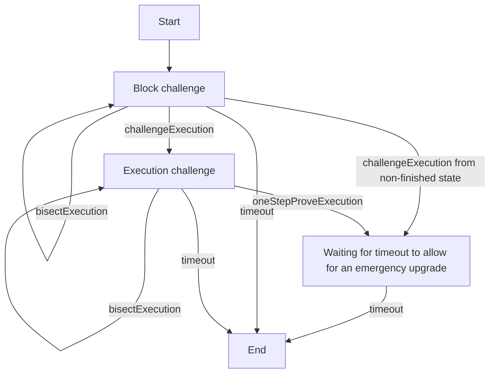

# ChallengeManager

The `ChallengeManager` arbitrates challenge games. Here's a diagram of the challenge state machine:

## Block challenge

The challenge begins by bisecting over global states (including block hashes).
Before actual machine execution is disputed, the dispute is narrowed down to an individual block.
Once the challenge has been bisected down to an individual block,
`challengeExecution` can be called by the current responder.
This operates similarly to a bisection in that the responder must provide a competing global state and machine state,
but it uses that information to transition to the execution challenge phase.

## Execution challenge

Once narrowed down to an individual block, the actual machine execution can be bisected.
Once the execution has been bisected down to an individual step,
`oneStepProveExecution` can be called by the current responder.
The current responder must provide proof data to execute a step of the machine.
If executing that step ends in a different state than was previously asserted,
the current responder wins the challenge.

## General bisection protocol

_**Note:** the term bisection in this document is used for clarity but refers to a dissection of any degree._

The `ChallengeLib` helper library contains a `hashChallengeState` method which hashes a list of segment hashes,
a start position, and a total segments length, which generates the `ChallengeLib.Challenge`'s `challengeStateHash`.
This is enough information to infer the position of each segment hash.
The challenge "degree" refers to the number of segment hashes minus one.
The distance (in steps) between one segment and the next is `floor(segmentsLength / degree)`, except for the
last pair of segments, where `segmentsLength % degree` is added to the normal distance, so that
the total distance is `segmentsLength`.

A challenge begins with only two segments (a degree of one), which is the asserter's initial assertion.
Then, the bisection game begins on the challenger's turn.
In each round of the game, the current responder must choose an adjacent pair of segments to challenge.
By doing so, they are disputing their opponent's claim that starting with the first segment and executing
for the specified distance (number of steps) will result in the second segment. At this point the two parties
agree on the correctness of the first segment but disagree about the correctness of the second segment.
The responder must provide a bisection with a start segment equal to the first segment, but an end segment
different from the second segment.
In doing so, they break the challenge down into smaller distances, and it becomes their opponent's turn.
Each bisection must have degree `min(40, numStepsInChallengedSegment)`, ensuring the challenge makes progress.

In addition, a segment with a length of only one step cannot be bisected.
What happens there is specific to the phase of the challenge, as either a `challengeExecution` or `oneStepProveExecution`.

Note that unlike in a traditional bisection protocol, where one party proposes segments and the other decides which to challenge,
this protocol is symmetric in that both players take turns deciding where to challenge and proposing bisections
when challenging.

## Winning the challenge

Note that for the time being, winning the challenge isn't instant.
Instead, it simply makes the current responder the winner's opponent,
and sets the state hash to 0. In that state the party does not have any
valid moves, so it will eventually lose by timeout.
This is done as a precaution, so that if a challenge is resolved incorrectly,
there is time to diagnose and fix the error with a contract upgrade.
